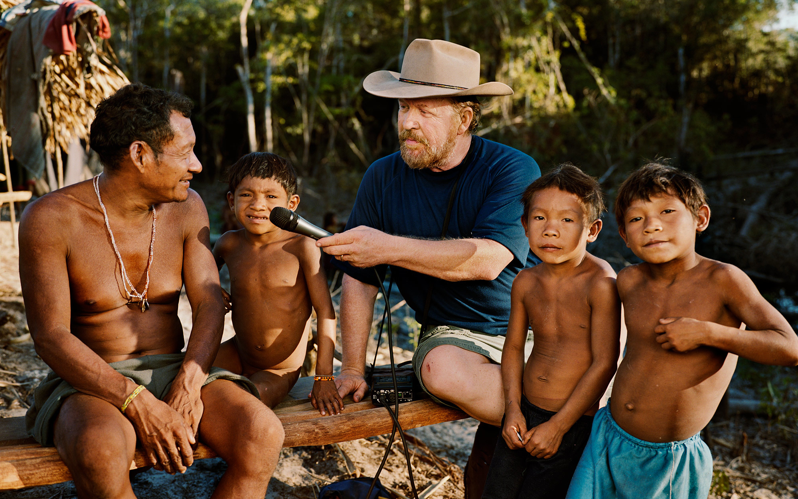

Human languages share few features that distinguish them from other form of animal communication. One of the most famous is recursion. In any language one can always form an arbitrarily long sentence. Always? Not quite. According to Daniel Everett, up to now the only non-native of the Pirahã Amazonian tribe who has ever understood their language, the Pirahã language does have a sentence of maximal length. Of course this statement stirred a durable controverse among linguists and prompted Noam Chomsky to criticize him as a 'charlatan'. Yet his story is interesting and, in my opinion, worth listening to.

##What makes Pirahã a language hard to pick up
Before Everett, all the previous missionaries had failed at learning Pirahã. It is thus reputed as a language difficult to learn.
It is a tonal language (high and low pitch on the vowels). There are only 3 vowels (i, a, o) and 8 consonants (p, t, h, s, b, g, the glottal stop and k). This is one of the smallest inventory of phonemes inventory of any known language. A smaller number of sounds implies that the length of Pirahã words is much longer than it would have been in a language with more sounds.

More interestingly, it lacks things that most other languages have: comparatives (big vs bigger) and abstract color words, just to name a few of them. It also distinguishes whether the speaker has seen the action or not (evidentiality). Most of the language can be whistled, hummed or encoded in music. The meaning can thus be solely conveyed through variations of pitch, stress and rhythm.

I find this excerpt of Everett's book, attempting to explain the difficulty of this kind of monolingual study, quite funny:

<blockquote>
Nonetheless, it is hard. Here is a typical exchange, after I had been there long enough to learn the Pirahã expression for *How do you say --- in Pirahã?*:

"How do you say that?" (I point to a man coming upriver in his canoe.)

"Xigihí hi piiboóxio xaaboópai" (The man upriver comes).

"Is this right: 'Xigihí hi piiboóxio xaaboópai'?"

"Xaió. Xigihí piiboó xaaboópaitahásibiga" (Right. The man upriver comes.)

"What is the difference between 'Xigihí hi piiboóxio xaaboópai' and 'Xigihí piiboó xaaboópaitahásibiga'?"

"No difference. They are the same."

Clearly, from the perspective of a linguist, there *must* be a difference between the two sentences. But until I learned Pirahã on my own, I had no way of knowing that the difference was that the first sentence means "The man returns upriver" and the second means "I am an eyewitness to the fact that the man returns upriver." This makes learning the language very rough going indeed.
</blockquote>

*Members of the Pirahã people of Amazonian Brazil. Essential Media & Entertainment/Smithsonian Channel*

##A life in Amazonia

Daniel Everett packed everything with his family to fly to Amazonia in 1977 and start a monolingual field work, quite a rare occurrence in linguistics fieldwork, for the next 30 years. The Pirahã concept of truth gradually influenced him up to the point of becoming an atheist, which triggered a divorce with his wife. Throughout his main book (*Don't sleep, there are snakes*) one can find many tasty and thoughtful anecdotes of his work.

>This morning was different. (...) A crowd was gathering about twenty feets from my bed on the high bank of the Maici, and all were energetically gesticulating and yelling. Everyone was focused on the beach just across the river from my house. (...) I turned to Kóhoi, my principal language teacher, and asked, "What's up?" (...)

<blockquote class="post-single__blockquote">
"Don't you see him over there?" he asked impatiently. "Xigagaí, one of the beings that lives above the clouds, is standing on the beach yelling at us, telling us he will kill us if we go to the jungle."

"Where?" I asked. "I don't see him."

"Right there!" Kóhoi snapped, looking intently toward the middle of the apparently empty beach.

"In the jungle behind the beach?"

"No! There on the beach. Look!" he replied with exasperation.

In the jungle with the Pirahãs I regularly failed to see wildlife they saw. My inexperienced eyes just weren't able to see as theirs did.
But this was different. Even I could tell that there was nothing on that white, sandy beach (...) Maybe there had been something there that I just missed seeing, but they insisted that what they were seeing, Xigagaí, was still there.

Everyone continued to look toward the beach. I heard Kristene, my six-year-old daughter, at my side.

"What are they looking at, Daddy?"

"I don't know. I can't see anything."

Kris stood on her toes and peered across the river. Then at me. Then at the Pirahãs. She was as puzzled as I was.

(...) Over the more than two decades since that summer morning, I have tried to come to grips with the significance of how two cultures, my European-based culture and the Pirahã's culture, could see reality so differently. I could never have proved to the Pirahãs that the beach was empty. Nor could they have convinced me that there was anything, much less a spirit, on it.
</blockquote>

*Dan Everett and the Pirahãs in 2009. Photo by Martin Schoeller/AUGUST*

## A heretic linguist ?
When he claimed - almost accidentally - that there existed no recursion in Pirahã language, violating one of the most basic axioms of Chomskyan linguistics, Everett unleashed a violent debate among linguists.
There has always been much debate to explain how in the world children know so much about language when there is so little evidence available to them. This points to the idea that there is something unique in human biology, dedicated to language. Whether human grammar is innate or not has thus become a focal point. Chomsky and other linguists put forth a hypothesis according to which recursion is the only human component of the faculty of language (this is a very fuzzy summary of [The Faculty of Language: What Is It, Who Has It, and How Did It Evolve?](http://science.sciencemag.org/content/298/5598/1569) of Marc Hauser, Noam Chomsky and Tecumseh Fitch). A language lacking this basic recursion would endanger Chomsky's whole theory about language and grammar, and as you may know already Chomsky has been an extremely prominent figure of linguistics for the past decades. The debate is still ongoing and you can find a more detailed account of it by Everett himself [here](https://aeon.co/essays/why-language-is-not-everything-that-noam-chomsky-said-it-is).

## Resources

* *Don't sleep, there are snakes: life and language in the Amazonian jungle* (2008). Pantheon Books, New York. Daniel Everett. The title of the book is the literal translation of the Pirahã greeting to say good night. (!) I really recommend this fascinating account of his years spent in the Amazonia jungle among the Pirahãs.
* *The Grammar of Happiness.* (2012) Documentary about Daniel Everett's story.
* [Chomsky, Wolfe and me](https://aeon.co/essays/why-language-is-not-everything-that-noam-chomsky-said-it-is) A detailed account of the controversy by Everett.
* Wikipedia.
