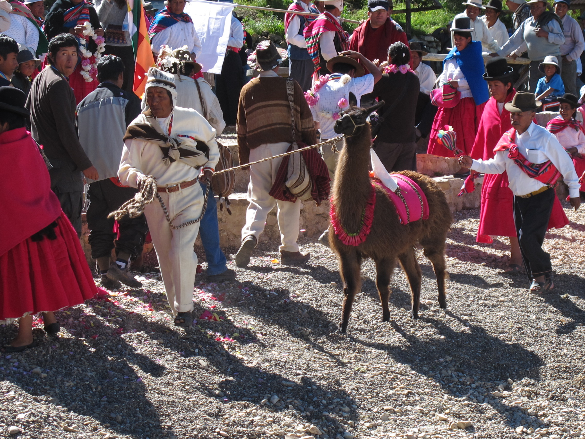
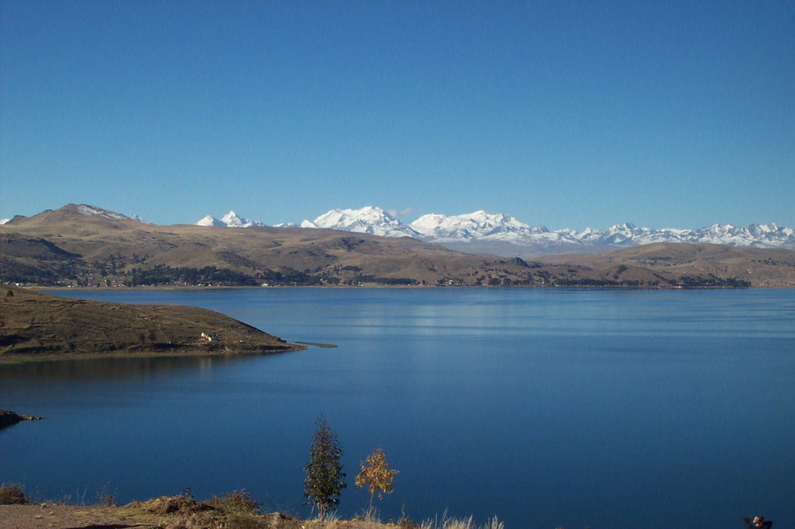

The Altiplano is a fascinating place at the heart of  the Andes, the most extensive area of high plateau after Tibet. It was the birthplace of several major civilizations such as Tiwanaku and the Inca Empire. In this landscape made of snow-covered peaks, lakes, deserts, salt flats, and high plains, the Aymara people speak a fascinating language full of surprises.

*La Paz, Bolivia. Largest city of the Altiplano and highest capital in the world.*

The Aymara language is spoken by the Aymara people of the Andes, within a large area encompassing Peru, Bolivia and northern Chile. Its native speakers count more than 2 million people and it is one of the official languages of Bolivia and parts of Peru. According to Rodolfo Cerrón-Palomino it could have been the official language of the Incas empire before the Spanish conquest. However it has lost many speakers to Spanish and Quechua. Nowadays most Aymara speakers are located in the Altiplano region.

*Map of Aymara language*

## The language
It is an agglutinative and SOV (subject-object-verb) language. To a certain extent, it is also polysynthetic. The Spanish missionary were the first to try to create a writing system for Aymara. It is thus written using the latin alphabet.

For example, *kullakanakaxawa* is made of *kullaka* (sister, young woman) + *-naka* (plural) + *-xa* (possessive suffix, my) + *-wa* (emphatic suffix).

A short dialog "What is your name ? - My name is Paulu." could be translated this way:

*Kunas sutimaxa?* (*kuna* what + *-s*, interrogation with informative answer ; *suti* name + *-ma* possessive suffix, yours + *-xa* secondary emphatic suffix)

*Sutixax Pauluwa.* (*suti* name + *-xa* my + *-x(a)* secondary emphatic suffix ; *Paulu* Paulu + *-wa* emphatic suffix)

It is the native language of Evo Morales (president of Bolivia since 2005) and Túpac Katari, an indigenous Aymara leader of a major insurrection during colonial times remembered as a national hero in Bolivia.

*Aymara ceremony*

## Can you see it ?
When we think of time, we often picture it as a line, a path where the past lies behind us while the future is ahead of us. This is true not also for Indo-European languages such as English but also for languages as diverse as Hebrew, Japanese or Bantu. Unlike most of us, for the Aymara people the past is what lies in front of you, because you know it, so you can see it. The future is behind you, since you have no clue about it. 

The Aymara word for past is *nayra*, which literally means eye, sight or front. The future is *q'ipa*, which can be translated as behind or the back. In 1975 already Andrew Miracle and Juan de Dios Yapita Moya from the University of Florida noticed that the Aymara word for tomorrow, *q'ipüru*, combines *q'ipa* (behind) and *uru* (day).

The Aymara people are not the only ones in the world to use this counter-intuitive representation of time flow. Maori speakers use front-type words to refer to earlier events. Malagasy uses 'in front of' to mean 'earlier than'.

Rafael Núñez, a cognitive scientist at UCSD, who carried a very minutious study of this aspect of Aymara language and confirmed this surprising fact, links it to the importance of vision in the whole language. Indeed Aymara uses different markers to tell whether the speaker saw the action happen or not. If eyewitness is so central in Aymara, there should be no wonder that the past becomes what one has seen. 

*Note: If you are interested in time representations in languages, I very highly recommend the paper ["How Languages Construct Time"](http://lera.ucsd.edu/papers/language-time.pdf) by Lera Boroditsky (2011).*

*Lake Titicaca*

## Resources
Most of the resources / textbooks are in Spanish. Although I don't speak Spanish, I am quite fortunate that for French speakers, Spanish is easy to understand - at least in its written form. If *¡Hola!* is all you understand, you might have to first learn some basic Spanish before diving into Aymara...!

Here are the few English resources that you can find.

+ Lake Titicaca. Legend, Myth and Science. Charles Stanish. 2011. Easy to read and with beautiful pictures. Written by UCLA anthropologist Charles Stanish, specialized in Peru, Bolivia and Chile prehistoric societies.
+ [Aymar Arux Akhamawa.](http://vrcusa.com/Aymara/) Miguel Huanca. 2011. The author is native to the Altiplano region and has been teaching Aymara for more than two decades at the University of Chicago. This is the only English(/Spanish/Aymara) textbook available to start learning Aymara, and a great resource (with MP3 recordings available).
+ Martha Hardman from the University of Florida is a pioneer linguist of Aymara, which she studied for more than 50 years. People interested in the linguistic aspects will find everything they can dream of in her articles. Miracle and Yapita were her students.
+ [How time flies.](https://www.theguardian.com/science/2005/feb/24/4) Laura Spinney, The Guardian, 2005.

The main resources are unfortunately only in Spanish.

+ K'isimira (1 & 2). Saturnino Gallego. 1994. Vol.1 covers the grammar and vol.2 is dedicated to thematic vocabulary. One of the most extensive, learner-friendly available textbooks (in Spanish).
+ [Ciberaymara](http://www.ilcanet.org/ciberaymara/) is website in Spanish by the Instituto de Lengua y Cultura Aymara to learn Aymara. The material is very good.
+ News in aymara: very recently a channel in Peru has started to broadcast a program in aymara called [Jiwasanaka](http://www.tvperu.gob.pe/programas/jiwasanaka). You can find on their website or on Facebook the videos of the program.
+ Songs in aymara: look for the Awatiñas group. Los Kjarkas, one of the most famous bolivian group of musicians, also recorded a beautiful song in aymara "Ukhamampi munataxa".
+ Applications to learn Aymara:
  + Kamisaki
  + Aprende Aymara
  + Tutor Móvil Aymara
+ Dictionaries: Although the reference aymara/spanish dictionary is still Ludovic Bertonio's 1612 massive edition, these ones are good compromises.
  + [English/Aymara online dictionary](https://www.inkatour.com/dico/index.php?lg=en)
  + Diccionario Bilingüe aymara/castellano. Félix Layme Pairumani. 2004 
+ [Thematic aymara basic vocabulary](http://bolivia.aymara.free.fr/index_uk.htm)
+ [Elias Reynaldo's blog](http://eliasreynaldo.blogspot.fr/p/blog-page.html) is full of resources for aymara learning.
+ Jaya Mar Aru. Método para aprender aymara. Lic Mary Mamani Tito & Qamayu Manuel Alvarado Quispe. 2015. Although grammatical explanations are almost inexistent, it comes with a CD.
+ Aymara Arunaka. Aprenda a leer y escribir en lengua aymara de manera más fácil. Juan Carlos Ancari Gonzalo & Betsaida A. Sajama Bustillos. 2006. As the title indicates, a basic introduction to the alphabet and vocabulary.
+ Aprendamos el idioma aymara... jugando. Donato Gomez Bacarreza. 2008. Comes with a CD. A concise introduction to basic Aymara.
+ Books bilingual Aymara/Spanish: 
  + Los grandes pensamientos de nuestros antepasados. Laq'a achachilanakan jach'a tayka amuyt'äwinakapa. Carlos Yujra Mamani. 2005.
+ Books in aymara:
  + Kamsapkakini. Julio Quispe Huañapaco. 2006. A story for children in aymara.
  + Aymar Lup'iwisa, Arsusa, Amuyusa, Sarnaqawisa. Zacarías Alavi Mamani & Yaqhanakamp kuna. 2008. Stories in aymara.
