*Disclaimer: I first wrote this text in spring 2015 for [X-Passion](https://x-passion.binets.fr/#/), the students magazine of Ecole polytechnique. This is a translation into English that I hope is not too intricate.*

*Ghost In The Shell* (GITS), in Japanese 攻殻機動隊 (Kōkaku kidōtai) is a famous animation movie directed by Mamoru Oshii that came out in 1995. It was adapted from an eponymous science-fiction manga of Masamune Shirow. In 2029 a special government unit, Section 9, to which belong two cyborgs Motoko Kusanagi (called "the major") and Batō, attempts to capture a mysterious and dangerous hacker, the Puppet Master.

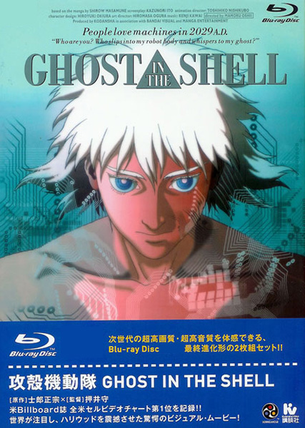
*Ghost In The Shell*

It inspired the brothers Wachowsky for a number of scenes in *Matrix* (for example the emblem of *Matrix*, green caracters falling into columns, already exists in GITS opening). Renowned for its tortuous scenario difficult to grasp, as well as for its philosophical reflections, it is well served by somptuous drawings and music (composed by Kenji Kawai).

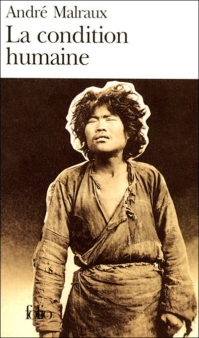
*Man's Fate*

*Man's Fate* (1933, *La condition humaine* in French) is a novel by André Malraux that is no less well-known (at least in France). It revolves around a group of communist revolutionaries in Shanghai in 1927, to which belong among others the characters Kyo and Tchen. They prepare an insurgency with the nationalists of Tchang Kai-Chek against the government. Historically, this ended with the Shanghai massacre of April 12, 1927, and marked the beginning of the Chinese Civil War which ended only in 1950.

Both of these works deeply impressed me, one after the other and each at their own time. After some maturation time, I was astonished to see some parallels emerge and that is what I would like to share with you here.

## Rain and water

Towards the middle of GITS one finds a rather long and masterful contemplative sequence during which the city and all its details are observed under different point of views, with solemn choirs in the background. The rain that starts falling at the same time as the night imparts an extraordinary melancholy to the last shots.

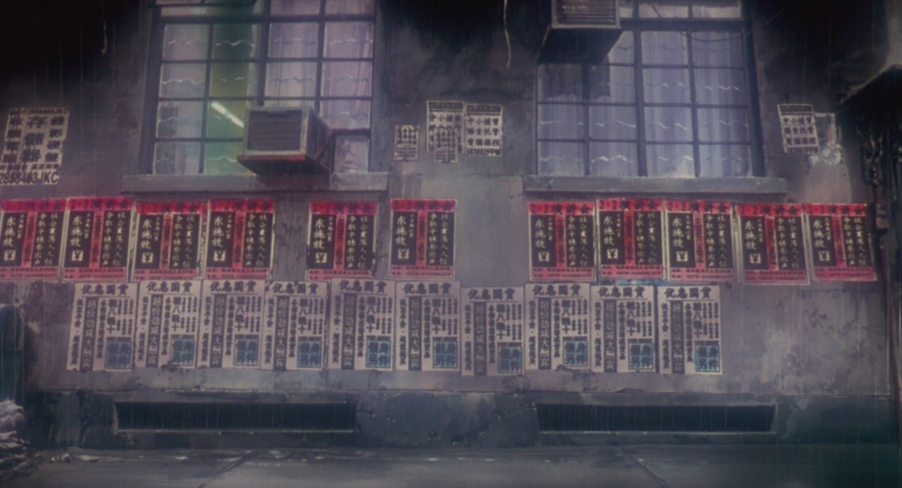
>*"Slowly filling with the long wail of a siren, the wind which brought the subdued rumble of the city in state of siege and the whistles of launches returning to the warships, passed over the dismal electric bulbs at the ends of blind alleys and lanes; around them crumbling walls emerged from empty darkness, revealed with all their blemishes by that unflinching light from which a sordid eternity seemed to emanate."*

In *Man's Fate* a very similar atmosphere can be found: towards the beginning of the novel, the city of Shanghai is described at night with an attention for details that reminds of GITS. The drizzle seems to veil the landscape with the same intensity as in the film.

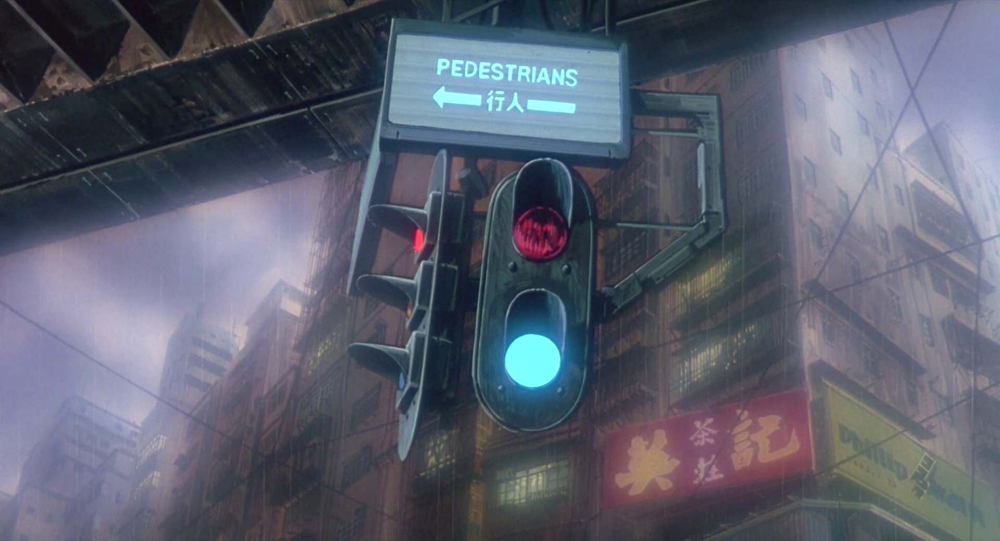
>*"The globes which protected the electric bulbs became misty, and in a few minutes the great rain of China, furious, headlong, took possession of the city."*

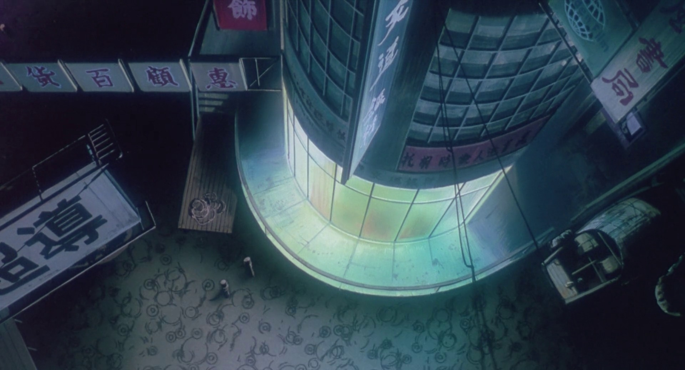
>*"A world from which men had disappeared, a world without end; would daylight ever return upon those crumbling tiles, upon all those narrow streets at the end of which a lantern lighted a windowless wall, a nest of telegraph wires?"*

As a matter of fact, water is a recurrent element in GITS. The next excerpt from *Man's Fate* reminds me in a striking way of Major Kusanagi's diving into the sea.

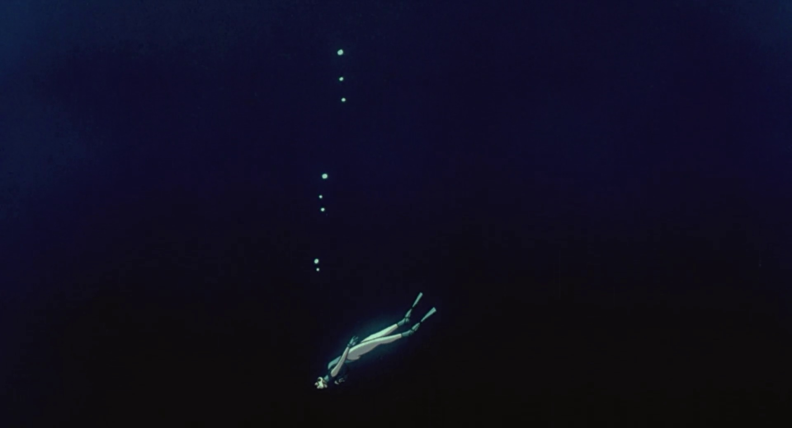
>*"He remembered a September afternoon when the solid gray of the sky made a lake's surface appear milky, in the meshes of vast fields of water-lilies; from the moldy gables of an abandoned pavilion to the magnificent and desolate horizon he only saw a world suffused with a solemn melancholy. Near his idle bell, a Buddhist priest leaned on the balustrade of the pavilion, abandoning his sanctuary to the dust, to the fragrance of burning aromatic woods; peasants gathering water-lily seeds passed by in a boat without the slightest sound; at the edge of the farthest flowers two long waves grew from the rudder, melted listlessly in the gray water. They were vanishing now in himself, gathering in their fan all the oppressiveness of the world, but an oppressiveness without bitterness, brought by opium to an ultimate purity. His eyes shut, carried by great motionless wings, Gisors contemplated his solitude: a desolation that joined the divine, while at the same time the wave of serenity that gently covered the depths of death widened to infinity."*

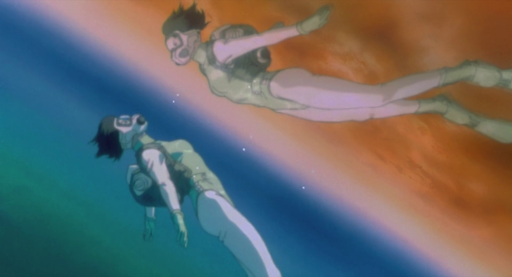

>- なぁ、海へ潜るってどんな感じだ？ ( How is it to swim in the sea ?)
>- 恐れ、不安、孤独、闇・・・ それから、もしかしたら希望。(I am afraid, I am cold. But sometimes, deep down, I have hope.)
>- 希望？真っ暗な 海の中で？ (Hope? In these dark waters?)
>- 海面へ浮かび上がる時、 今迄とは違う自分になれるんじゃないか、(When I float in weightlessness, I become another.)

## Self-identity: Questions and quests for meaning
The interrogations and reflections of the characters are fundamentally the same in GITS and *Man's Fate*.

>*"It is very rare for a man to be able to endure - how shall I say it? - his condition, his fate as a man..."*

During the whole film Major Kusanagi endeavours to define and accept her human condition in an artificial body. The Puppet Master, at the opposite, attempts to make himself accepted as a living being despite his artificial nature.

>*"I've had the experience of finding myself unexpectedly before a mirror and not recognizing myself..."*

*Man's Fate* continually questions what defines men and gives them identity. Kyo does not recognize his own voice when he hears it, Gisors sometimes does not recognize himself in front of a mirror... It is impossible to not link it to the main theme of GITS, the quest of Major Kusanagi (as of the Puppet Master) for a definition of its soul and identity.

The echoes of this quest resonate throughout the film. One can think for example of the passage when the Major, standing at the edge of the boat, briefly notices a woman who strangely looks identical.

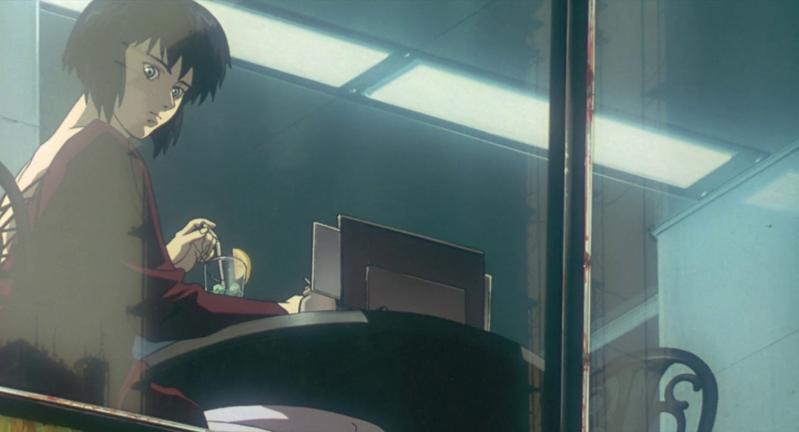
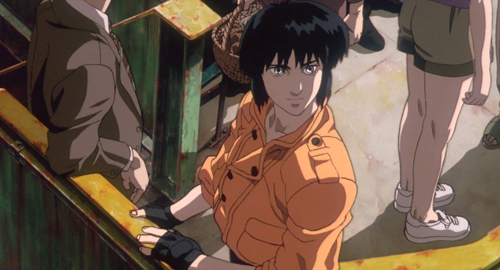
>*"One never knows a human being, but one occasionally ceases to feel that one does not know him."*

Does this quote not apply perfectly to the relationship between Batō and Kusanagi? She never ceases to appear as an enigma for Batō, who does not share her existential anguishes; yet he remains her closest confidant.

We shouldn't forget what gave the title (at least the English one) of the film and which recurs multiple times throughout it, the "ghost" (soul inside us) and the "shell", package hosting the "ghost". This idea can be found in the Baron Clappique's reflection:

>*"No, men do not exist, since a costume is enough to enable one to escape from oneself, to find another life in the eyes of others."*

This concept of "ghost" and "shell" is illustrated in GITS by the example of the unfortunate dustman who discovers that his whole world was a fiction... And who has no memories left. Who is he, in the end, without these memories? Memory... which defines men. What can we read about this in *Man's Fate* ?

>*"How do you expect anyone to understand things, except through mem'ries?..."*

## Contemplation

One of the striking characteristics of GITS holds in these masterful "silent" passages which punctuate the film: as only Kawai's music intervenes, the shots and drawings (always wonderful) take turns with an intensity almost more significant than words, truly conveying to the spectator a special atmosphere. These moments bestow the film an extroardinary rhythm and uplift it to a far greater level than simple action movies.

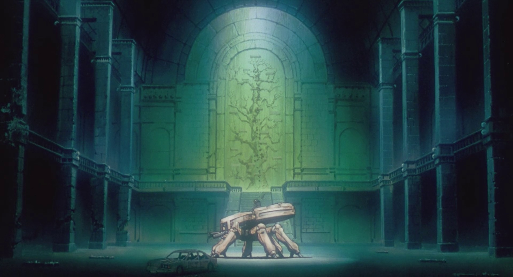

In my opinion *Man's Fate* owns a similar quality. The novel is interspersed with purely contemplative passages, mixing visual effects and deep reflections, served by an unstained writing style.

## Play with light

Another interesting similarity: both the film and the novel make an incisive use of the clarity/obscurity in their incipit. Whether it is the play of moonlight with the shadow of the mosquito net in *Man's Fate*, which characterizes the first murder and by extension the "birth" of Tchen as a terrorist, or the strong contrast between light and dark colors for the "birth" of Major Kusanagi, which reaches its pinnacle during her first awakening in her room, with an almost blinding opposition between the outside daylight and the inside darkness.

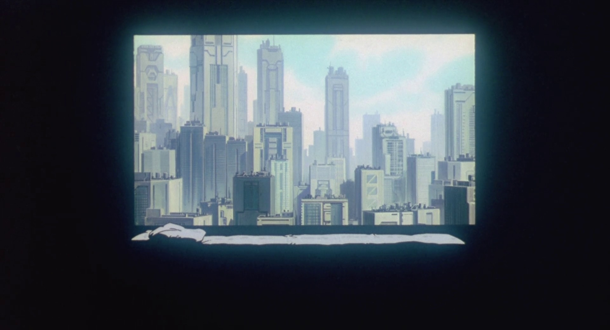

This usage of clarity/obscurity, if it can symbolize a birth by the intrusion of light in obscurity, can also at the opposite be a warning of what awaits the characters, their fall into darkness: diving into the terrorism abyss for Tchen, or the immersion into the grim reality of the future for the Major.

One should note that GITS ends with an almost monochromatic drawing, just like *Man's Fate* finishes on a dazzling and saturated landscape. Both conclude with a meditative contemplation of a spectacular landscape (strange coincidence, a bay in both cases).

>*"He looked out upon the magnificent bay, saturated with sunlight."*

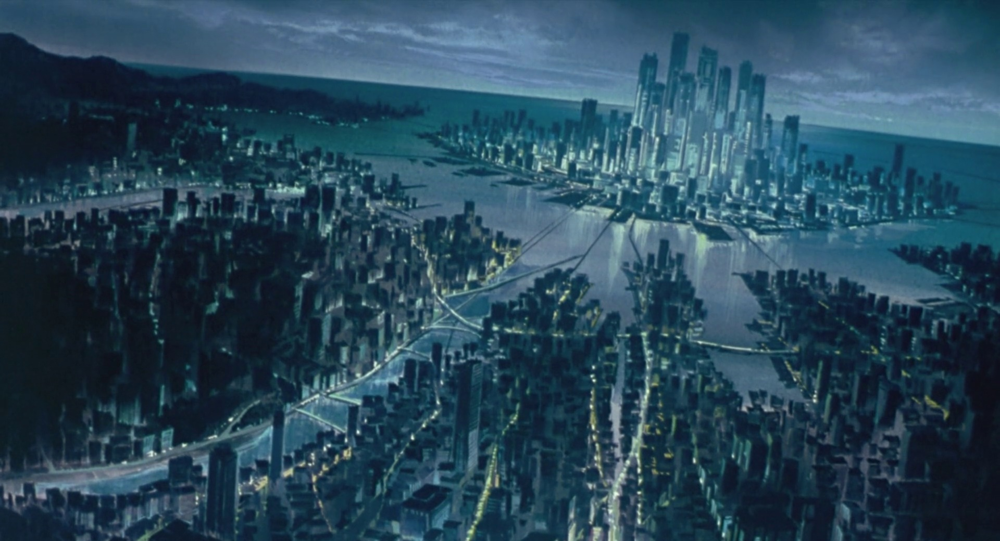

## Political and historical plot
A complex narrative weave was often hold against GITS, with a nonnegligible poltical dimension, but *Man's Fate* is not to be outdone: the novel wants itself to be historical, set at the time of Shanghai massacre in between the two World Wars. The multitude of stakeholders with murky motivations and unstable positions is not obvious to understand for who ignores everything of this event. Similarly it is difficult to grasp the complex political game that unrolls in GITS, whether it is the Republic of Gavel or the war between Section 9 and Section 6. In both cases, this background is like a weak reflection of the complexity of the interrogations of characters in the foreground.

## The Reflection figure

In both works we find a masterful figure which spans across the whole narrative, with an overhang point of view on the flow of events, and a role of spokesperson for some reflections (from the author?).

In *Man's Fate*, it is Kyo's father, Gisors, who shoulders this role. Without taking an active part in the action, he is a father figure for many characters. He witnessed the premices as well as the end of this revolution. He also shares regularly his own melancholic reflections through extended tirades. Almost only survivor (with May, whom we will discuss later) he will have witnessed the birth and conclusion of this human tragedy, and will be alone to draw its conclusions (if there are any).

In GITS, one could suggest that it is the famous "Puppet Master" which plays this role: throughout the film, thanks to its elusive and intangible position in the network, he is a background figure which pulls strings and knows everything on everything. During the memorable passage in the abandoned museum, he discloses himself at last and delivers the reflections that are haunting him.

## The Companion figure
This figure is differently important: it acts as a counterweight to the Reflection figure and sometimes feeds its reflection. In *Man's Fate*, one can think of May, precious support of Kyo, only survivor with Gisors to the disaster. In GITS it is Batō who shoulders this responsibility, as witnessed by the dialogs in the elevator or on the boat during which the major confides in him her anguishes. It is also him who will help her through the last ordeal and who will accompany her to the end.

A last word on the epilogs: both produce the friendly separation of these two figures, May and Gisors in the novel, Batō and Kusanagi/Puppet Master in the film. Both sole survivors of very different but human catastrophes.

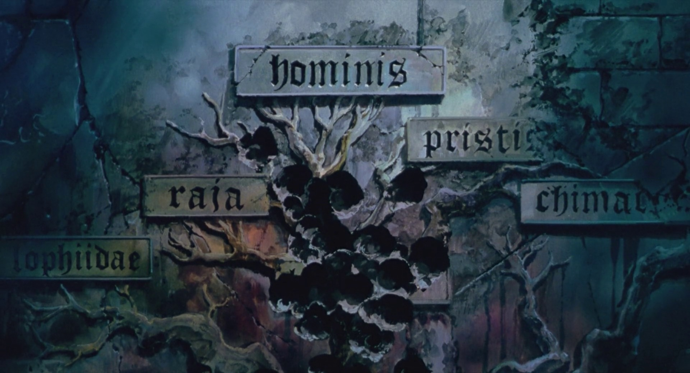

## Conclusion
After digging into both works to make these parallels emerge, one can question the existence of major differences between them. Should we conclude that the filmmaker of GITS was highly inspired by *Man's Fate*? I did not find any tangible, material clue of such a convergence, nonetheless one cannot exclude the possibility of an unconscious influence, the film being largely posterior to the novel. The reader will stay the only judge....
