If you look backwards and try to understand how you landed where you are, there isn't always a clear-cut path in the jungle of the past.
One fine summer day, I reached one of these turning points that seemingly come out of nowhere when I decided to make a guitar.
Mind you, I do not have any woodworking or instrument building experience. I started reading everything I could find about lutherie and the magic of guitar making. Pretty soon it dawned on me that I would have to pick up some basic woodworking skills. It also became clear that there was no good, solid work table in the apartment that could be monopolized for an indefinite amount of time. I would need a proper workbench. Very logically, this turned into a quest to *build a workbench*, before I could start making my own guitar.

There exists an impressive amount of literature on woodworking benches and their design. From *The Workbench Design Book* (2011) to *The Anarchist's Workbench* (2020), Christopher Schwarz seems to be one of the most prolific contemporary expert on the subject. He will make you see workbenches in a whole new light, within a historical perspective that goes back centuries. After doing my homework, I settled on a popular French design from an 18th century carpenter called André Roubo, which I twisted along the way to adapt to my (modest) needs.

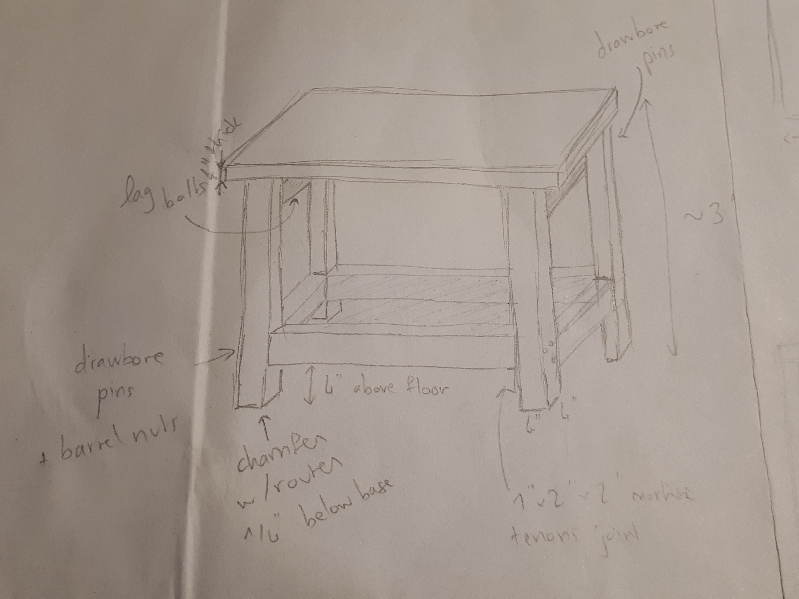
*It looks quite simple. Refining the details of the design took a few weeks, going back and forth between barrel nuts, drawbored mortise/tenon joints, tusk tenons, wedged through tenons, etc.*

This post is a (compressed) chronicle of the construction steps and design choices that I made.

##1. Laminating the top
I assembled wood from various sources: scrap woods, garage sales, home centers... The workbench ended up being made of softwood (Douglas Fir). At first, because I was a newbie, I planned to laminate two slabs of 2x12 to reach a thickness of 4". Alas! After inquiring among more experienced woodworkers, it turned out that there was a good reason why most people make their workbench top from laminated 2x4. Accounting for wood movement (warping, cusping, etc) is way easier on small pieces laminated together. On to rip the 2x12 into 2x4 pieces... Sigh.

*I had to come up with a number of makeshift saw horses and work tables... because if you are building a workbench, it usually means that you do not have one yet. This was the setup when ripping each 2x12 into three 2x4 pieces.*

It was a good exercise to learn how to use a saw. And it is surprisingly hard to keep cutting on a straight line.

*All the parts for the top (12 2x4) and the legs (4 4x4) are ready. That is a lot of wood - at least for me.*

I had decided to go with a split top design. This means there will be a 1"-2" gap in the middle of the benchtop, which can be filled with a wood filler serving as a tool tray or (if you flip it) a planing stop. Removing the tool tray also allows to clamp things from the middle of the bench. This idea is floating around on the internet, but it seem to have been popularized by the Benchcrafted workbench design. Admittedly, this also allowed me to handle the top on my own - a single slab top would have been way too heavy for me.

*Learning how to use a block plane and a scraper while trying to make the 2x4 pieces roughly flat before attempting to glue them together. A lot of trial and error...*

Anyhow, this meant laminating 2 packs of 6 pieces each. The pedestrian path prevailed: gluing them by pairs and waiting for ~2h before gluing the pairs themselves. This step in theory also requires *a lot* of clamps - like, a lot. I made due with dumbbells and an anarchic pile of heavy crap.

*Finally, these dumbbells found a use in the house.*

*Collecting the heavy books and random items in the house and putting them to an unexpected use.*

A weekend of spreading glue on these 2x4, clamping, waiting, and iterating, somehow resulted in two serious-looking slabs that (with a lot of imagination) would end up being a table top!

## 2. Mortises and tenons
This was hands down the best way to learn how to make a mortise and tenon joint: the workbench base required 16 of them, to join the legs and the stretchers alone. I swear, while working on this part, I spent at least one entire night dreaming solely of mortises and tenons and how they fit (or not) together. There was only a pinch of obsession.

Cutting the tenons with the Japanese saw was easier than it looked like. Weary of how my sawing precision, I drew the outline of the mortises on the legs afterwards. Cutting the mortises turned out to be more challenging. At first I set to use a drill to remove most of the material and then chisel out the walls. I learned how to use properly a chisel at this occasion - it never occurred to me that you could need a *mallet*, until I got tired of failing at cleaning the first mortise and watched a video on hand-chiseling a mortise. Enlightenment is such a wonderful thing.

Further enlightenment dawned on me after I watched a video from a Japanese woodworker - his technique for cutting a mortise was even cleaner and easier than the traditional Western one. I couldn't believe my eyes the first time I tried it! Suddenly it became *almost* faster to cut a mortise by hand using his technique, rather than drilling most of the waste and paring away the sides. As I hoped, this workbench project was a fantastic learning experience.

*Instead of vertical stabs spaced along the mortise, this technique removes horizontal chips from the middle of the mortise towards the ends (where a stop cut has been made).*

Fitting the tenons to their mortises was more time consuming than I expected, but little by little, after learning the difference between a file (for wood or metal) and a rasp (for wood-only), all the tenons managed to fit.

*Tusk tenons for the long stretchers, still in a rough stage.*

The traditional design of the Roubo workbench calls for sophisticated through-tenons between the legs and the top, including a half-dovetail tenon. There was no question that this was above my skillset... I wanted to be able to knock down the bench if necessary. I also preferred the top to be locked to the base. For the long stretchers, I decided to go with __tusk tenons__ (similar to a Moravian bench, with walnut wedges) against the more common bench bolts (e.g. Benchcrafted design). The shorter side stretchers won't ever need to be knocked down, so the mortise and tenon joints on each sides are __drawbored__: a dowel (walnut here) is hammered through the mortise walls and the tenon cheek, with an offset between the two that drives the joint incredibly tight.

*Cutting flush a dowel from a drawbored joint. The flush-cutting saw has a blade that bends easily and its teeth have no set, meaning they all lie in the same plane and won't scratch the wood around, as long as you keep the blade flat.*

Once the base was assembled, it felt like the bench was done! One of the very last design questions, that I left unanswered for a long time, was how to attach the top to the legs and the base. Two seemingly popular options were: lag screws in the top side stretchers, or floating tenons on the top of the legs. Since I had decided not to use any glue in the assembly, it felt unfair to use screws. For a very long time, I played with the idea of floating tenons and it seemed reasonable enough. I wasn't completely satisfied though, so I kept an eye out every time I discovered new joints, in case they could be applied to this pet problem of mine. One day, I read about a fine table whose maker mentioned "sliding dovetail keys" to attach the top of the table to the bottom. A few Google searches later, I was amazed at the simplicity of this joint (more commonly referred to as "blind housed dovetail") and the ingeniosity of woodworkers. I was now convinced that it HAD to be adopted for all four legs.

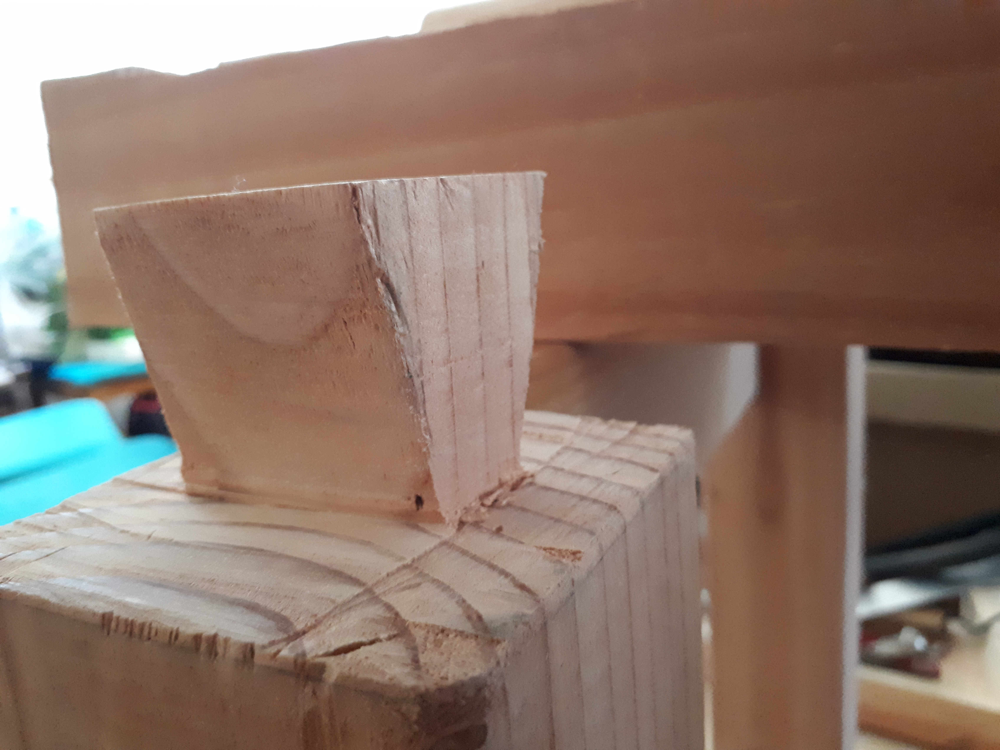
*Dovetail tenon on top of the legs. It is ugly, but it works well enough.*

Each leg has a dovetail tenon that first fits into a square mortise in the top, then slides into an adjacent dovetail mortise that locks it vertically. Having the legs slide from either side in opposite directions also avoids a potential top-sliding-on-legs problem, as it locks the top in either longitudinal direction.

## 3. Flattening the top
Due to very limited sawing skills when ripping the 2x12, the 2x4 were only *approximately* straight on their long edges.
When the time came to flatten them, I lacked a proper scrub, jack and jointer plane.

*Time to rectify our shameful inconsistencies...*

I looked around for a way to achieve a reasonable flattening.
The internet quickly yielded an interesting jig to flatten a table top with a router: a router sled, first proposed by Tage Frid. A scrap plywood lying around seemed perfect for the occasion. I learned how to countersink wood screws and a couple screws later, a functional router sled had emerged.

*A router sled! Granted, it is very basic. It rides on two planks whose height is adjusted with bits and pieces of scrap wood. It only has one alignment tab that can be clamped to the side.*

That was a real savior given how irregular and bumpy the top was. For multiple reasons the result after using the router sled was still not quite perfect, so I set on finishing it using hand planes. This was its own parenthesis in the workbench adventure...

## 4. Building a Krenov-style hand plane
A hand plane about the size of a jack plane was necessary to begin with, and it was tempting to build one using the very simple design of James Krenov. I ordered a blade from Hock Tools, which it turns out is located in California.

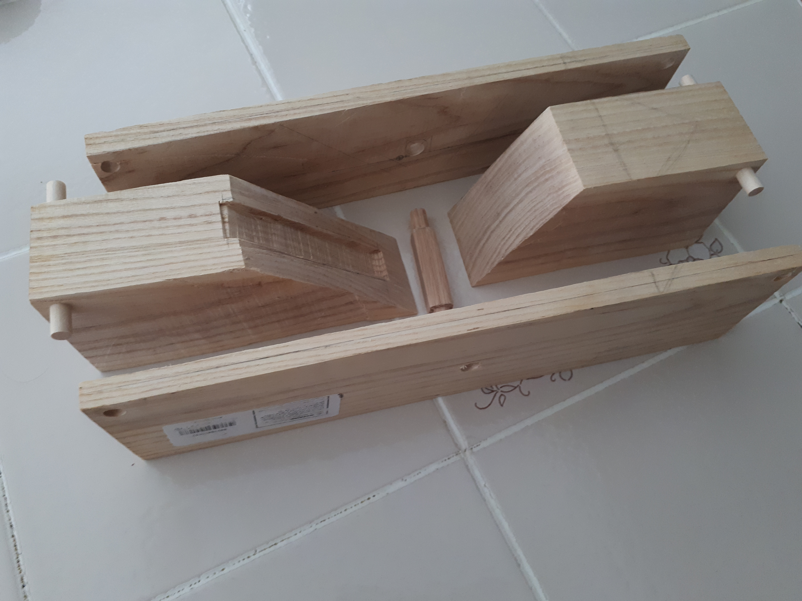

The body is made of ash, the wedge of walnut and the cross-pin of oak. I wanted to build a jack plane, so the body is 24" long. I discovered that sawing hardwood was an entirely different feel from sawing softwood. I read somewhere that building a Krenov hand plane is a matter of 1 day of work. That may be true *if you have a band saw* or table saw to cut the cheeks quickly, and if you know what you are doing (i.e. not in my case). It took a bit of work with a hand saw, but I certainly got better at sawing in the process...!

*Gluing the assembly, without forgetting the cross-pin. Cauls on each side ensure an even pressure on the cheeks.*

It is far from being perfect, but it worked well enough for our purpose. And what an amazing feeling to be working the wood with a hand tool that you made by yourself...!

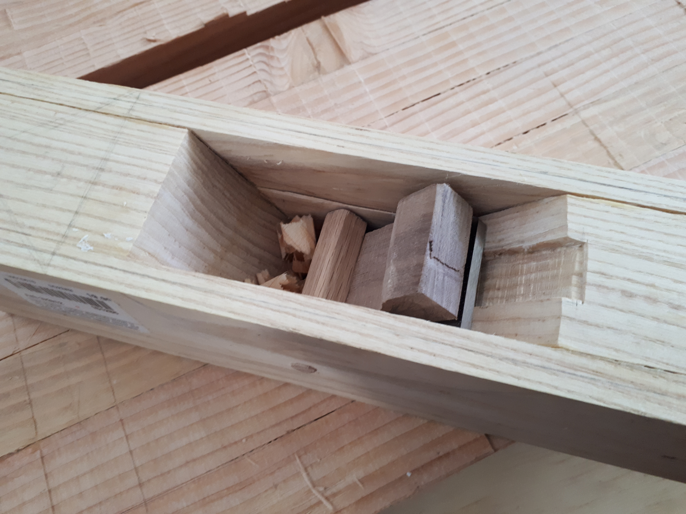
*I didn't have high expectations, so when the first shavings came out of the throat of the plane, at first try, I was amazed.*

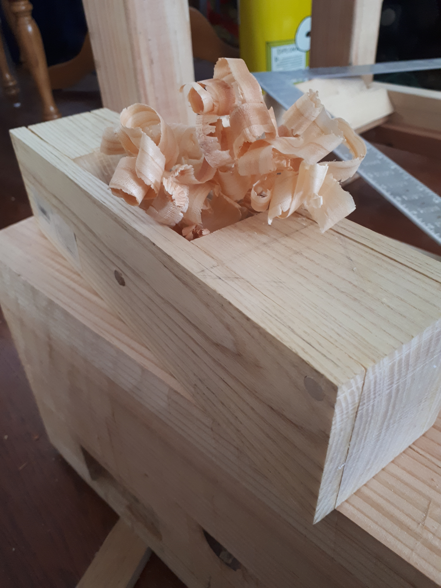
*As I became better at wielding the plane and sharpening its blade, the shavings became even more beautiful (in my view, at least).*

*There were a myriad of small tasks to complete before assembling one final time the whole workbench. I am very proud of achieving fair chamfers on the legs underside, using the block plane. We all get our satisfaction and pride from different places.*

## 5. Leg vise
During the build I would often long for two things: a workbench to work comfortably on (and stop chasing the wood piece around the couch while holding a chisel in one hand and a mallet in the other hand), and a vise to clamp things. For example, to shorten some metal screws, you need something like... a vise. Unfortunately, I needed to shorten some screws in order to build my vise. Hmmm...

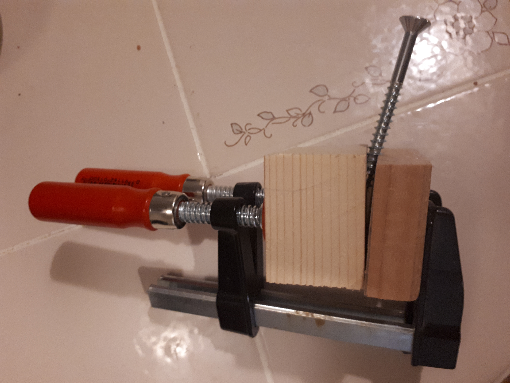
*Makeshift vise to hold the screw...*

 Given the small size of the workbench top, a front vise wasn't an option. Instead I went the way of the traditional leg vise, which the Roubo design couples with a sliding deadman (which I skipped, because I do not plan to clamp extra long pieces).

*The screw is a $30 vise screw from Yost. It is quite literally the largest screw I ever had in hand (almost 1 1/4 inch diameter, 18 inch long).*

Again, there are a lot of designs around for a leg vise. The most traditional way is using a parallel guide sliding through the leg that you pin at different thicknesses. Other options include a criss-cross (expensive), a metal shaft with ball bearings (also somewhat expensive), various mechanical designs involving chains (just involves too much metal for my taste), etc.

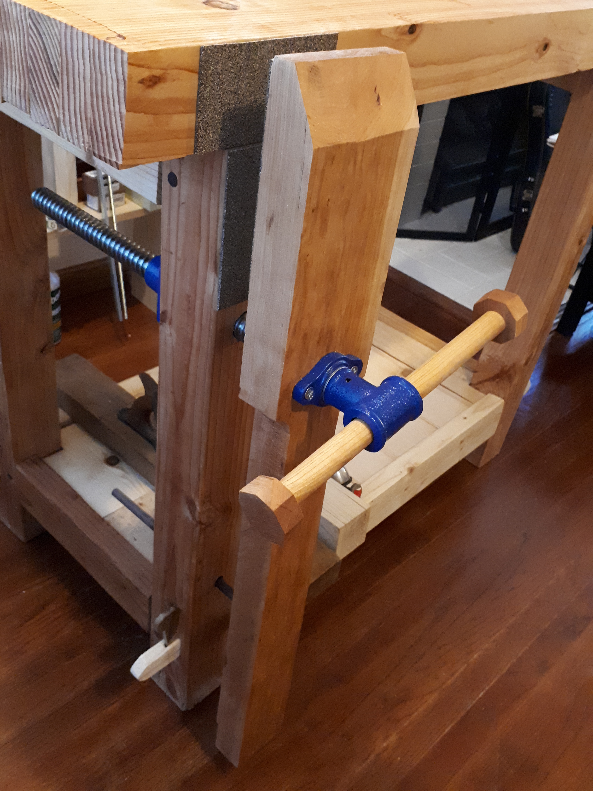
*You can see at the bottom the 1/2" walnut dowel that guides the leg vise. The jaws of the vise are lined with Crubber from Benchcrafted, a composite material made of rubber and cork.*

The poor man's option seemed to be the wedge on the floor or "pile block", which was described in great details by Jay's Custom Creations [here](https://jayscustomcreations.com/2018/02/hickory-workbench-leg-vise-and-dog-holes/). I followed this route, installed a dowel through the leg to prevent the leg vise from rotating... and realized a wedge wasn't really needed anymore. The wooden rod binds in the hole when the vise is tightened further after hitting the object in its jaws. (It might help that I drilled the vise screw hole at a slight angle.) Simplicity is always best. So far it holds up well!

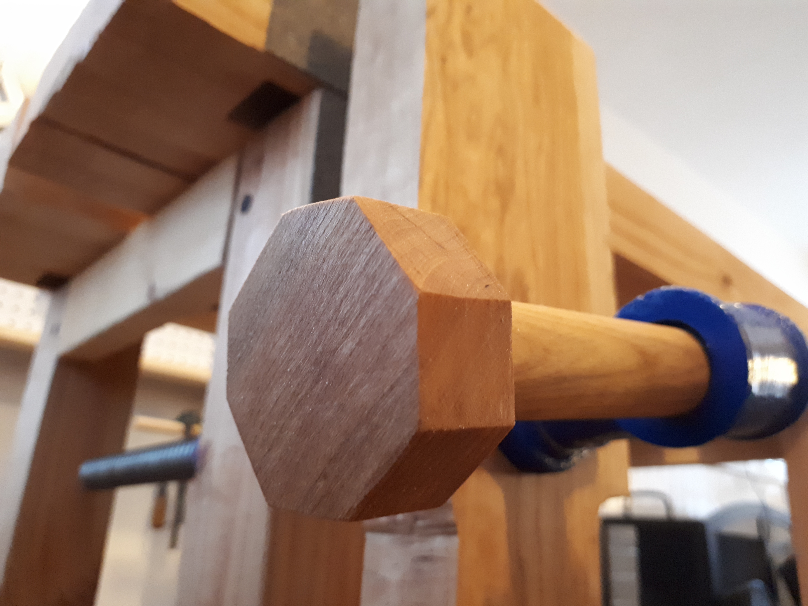
*The handle is a 1" cherry dowel with octogonal ends from cherry offcuts.*

## 6. Bottom shelf
Another after-thought came while assembling the base - a shelf at the bottom would be super handy. Sadly I didn't have the patience to cut a dado by hand in the stretchers. It also didn't seem wise to thin the only 1.5" thick stretchers. Instead I opted for additional ledgers, fastened using wooden Miller dowels. It is silly, but I was still reluctant to consider adding metal screws to the build...

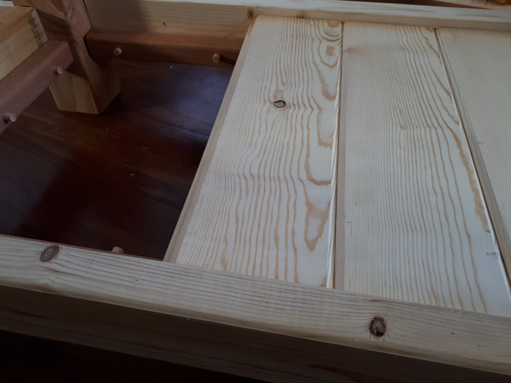
*Bottom shelf in installation stage. You can see the pink-ish ledgers attached to the stretchers, and the Miller dowels protruding because I hadn't had time to cut them flush yet.*

## 7. Pegboard panel and finish
By the end of this adventure a decent amount of hand tools had ended up in the apartment. They needed a better home than Amazon cardboxes and a precarious plywood shelf. The obvious solution was to include a pegboard panel behind the workbench. That was a piece of cake compared to the making of the workbench! I was bold and attempted to screw the tall sides at an angle, so that the panel would rest on the wall like a ladder. It worked!

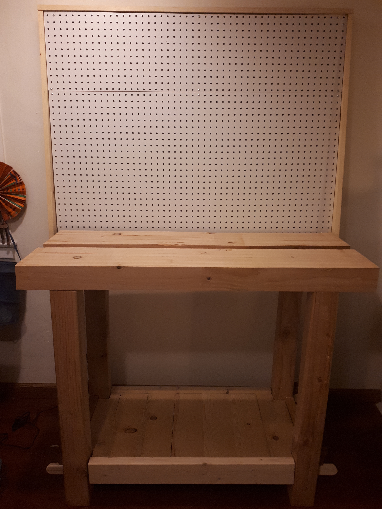

The finish of the workbench took some more homework reading. Initially I settled for an oil/varnish blend such as Danish oil, but after trying the Watco Danish oil on a piece of scrap, I was put off by the terrible smell - toxic fumes, I am told. Needing a respirator mask and gloves to work on the wood finish seemed like a bummer. I ended up getting some "Danish oil" (actually polymerized linseed oil) from Tried & True which, being a food-safe finish, does not require any of these protections. Good enough to make the grain pop and protect the wood a minimal amount.

## The end - almost

This isn't quite the end - I am still considering adding the middle insert (which serves as a tool rack, or if flipped over, a planing stop). But this bench is in good enough shape that our apartment isn't covered in wood chips all over the place anymore, and I can start thinking of ordering the wood for a guitar!

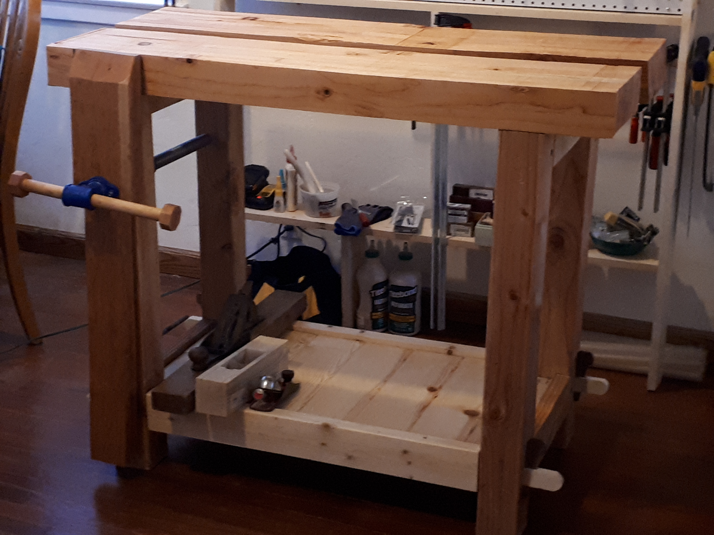

When I started this journey I didn't quite envision spending three months building this workbench - but it was well worth it. I now feel much, much less intimated by woodworking and I am incredibly excited to to tackle my real goal - making a guitar with my hands. This will probably take a decent amount of time and be the subject of another never-ending blog post.
