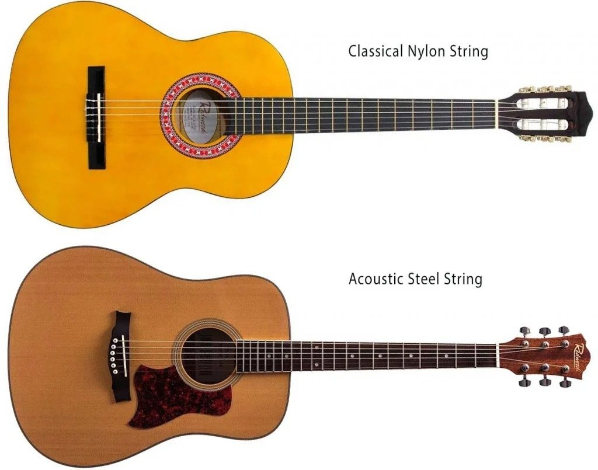

Before setting out to build a guitar, I attempted to understand how to design one. There isn't a monolithic reference book on guitar design, at least none that I could identify. Instead I gathered tips and insights from a variety of sources. This post is my attempt to summarize what I have read so far. Instrument design is a fascinating topic that sits at the confluence of physics, engineering, art and craftsmanship. One can get an intellectual understanding for how the instrument works in theory - in the case of the guitar, the vibrations of the strings produce a sound which is amplified by the guitar body. The string length determines the sound pitch. Engineering comes in to keep the instrument together - make it resonant but keep it from crumbling under the tension of the strings. Art is in the design of pleasant shapes and craftsmanship comes in the joint execution of all these ideas to make an object that will be practical to play, beautiful to look at, resistant to weather changes, durable for centuries and sounding as best as the subjective opinion of the instrument maker.

*Painting by Jacob Dhein - The Luthier, 2013.*

There are a lot of objectives that the instrument maker is trying to optimize for. And none of them can be singled out, optimized independently of the others. One can try to scientifically analyze the sound patterns and come up with sophisticated models, such as the Kasha strutting systems. One can come up with ingenious joints to attach the neck to the body, or the headstock to the neck. One can meditate for hours and days to find harmonious curves for the body shape. One can craft perfect wood joints and wield the chisel like a demi-god. But none of this will, by itself, lead to a good guitar. Only a combination of all these skills can open that door.

*Parts of a guitar (image from [Sheldon Conrich](https://sheldonconrich.co.uk/guitar-tips-parts-of-a-guitar/)) which I might be referring to in this post.*

The overarching design principle of a guitar is to find a compromise between the lightness and flexibility of the soundboard, which allows vibrations to transmit the sound, and the stiffness required to resist the strings tension. Unlike bowed instruments, where the bow is transmitting a lot of energy to the strings (almost as if it was continuously plucking the strings), plucked instruments like the guitar have to make the most out of a small amount of energy imparted to the string by each pluck. Hence, it has to capture the sound and amplify it.

### Classical vs acoustic guitar

*Image from [Dawsons Music & Sound Ltd](https://www.dawsons.co.uk/blog/classical-vs-acoustic-guitars-right)*

The most striking visual difference between a classical and an acoustic guitar is probably the shape of the headstock and tuning pegs, which harbors slots in the case of the classical guitar. As you might know, a classical guitar uses nylon strings while an acoustic guitar uses steel strings. This means that an acoustic guitar has to withstand a much higher string tension than a classical guitar, which in turn will influence design choices such as the strutting. Putting steel strings on a classical guitar is a no-no - this is a sure way to destroy your classical guitar, which is not built to resist steel strings tension. The neck is also narrower on steel-strings and there is less spacing between the strings themselves. I have read mostly about classical guitars, so I may be missing out on some parameters for acoustic guitar design.

### Scale length
An important design choice is the scale length. That will determine a lot of the guitar geometry and the frets position. By definition the scale length is measured from the nut to the bridge, and the 12th fret stands exactly at half of the scale length. The standard scale length nowadays is 650mm, but there are still guitars built with smaller length scales down to 610mm - this usually accompanies a smaller guitar body size, and can suit better smaller hands.

### Plantilla and body dimensions
Each maker, it seems, has his own plantilla or body shape with curves that seem pleasing to his eye. Although in theory the body shape might influence the resonance of the guitar, in practice it is not considered to be a major parameter. This is where art can take the lead and dictate the choices. Draw it free-hand or with the help of French curves, or copy an existing plantilla drawing, that part is up to the artist that lives in each luthier.

### Flat, domed or arched soundboard
A domed soundboard is curved along one dimension (its width). An arched soundboard is curved in both dimensions. Structurally a domed or arched soundboard is said to be more resistant to the tension of the strings. It can also contribute to getting the action right.

### Getting the action right
The action is the height of the strings above the fretboard or fingerboard. A lower action means it is easier to play single notes, but harder to strum chords without buzzing. Although it can be slightly modified afterwards by filing the saddle, for example, it should not be neglected in the design phase. The designer should aim for an action above the 12th fret of about 3-4 mm for a classical guitar. How to achieve it will be a combination of several design choices. The bridge height above the soundboard, of course, will matter. As a result, the dome or arch of the soundboard must also be correctly estimated. But the fingerboard could be tapered from the nut down to the rosette, too, to accommodate the target action.

### Strutting the soundboard

*Illustration borrowed from "Classical Guitar Construction", Irving Sloane, p.16.*

Soundboard bracing or strutting refers to the thin wooden braces that are glued on the inside of the soundboard. Some of them have a structural role - for example, reinforcing the bridge area which is sustaining the most tension or enforcing the soundboard arching. The traditional view is that a lot of them serve to "shape" the sound of the guitar: for example, a fan pattern as pictured on the left above is believed to impart more power to either treble or bass depending on how many fans brace each half of the soundboard. For a scientist, the topic of soundboard strutting is quite fascinating. It reminds me of the glorious alchemy era before chemistry came along to explain how different products reacted together. Each luthier has spent years experimenting with different bracing patterns, brace profiles, brace wood and is likely to hold strong opinions about their effect.

> "Everything in lutherie is intelligent guesses." - Ervin Somogyi

### Others

The angle between headstock and neck is yet another variable open to the designer. It will mostly influence the tension of the strings when they pass above the neck. Too steep of an angle might put too much pressure on the strings. The rosette size and design is primarily an aesthetic choice, although one might argue that it theoretically plays a role in the acoustic system. Purfling and binding are thin wooden strips glue to the edges of the guitar. Binding (the outermost strips) seal the end grain of the guitar wood. Purfling (the inner strips) are purely decorative, they participate to the general look of the guitar. The joints between the neck and the headstock, or the neck and the body, are usually craftsmanship decisions. For example creating a perfectly shaped 2mm wide slot in the heel to house the ribs (traditional Spanish method) might be more challenging to execute than a wider slot where the ribs can be wedged (the Romanillos approach). The soundboard thickness is also a design choice. Some luthiers keep an even thickness everywhere, others like to make the soundboard thinner towards the edges (where it has less tension to resist).

Now, have we covered the main parameters of guitar design? Of course not, we are missing one of the most important - wood. There are woods that have been used traditionally - a combination of practicality due to the local availability of some woods, and their suitability to make instruments. Many luthiers now experiment outside of this traditional pool of woods to try making instruments with local or native woods. Beyond the wood choice, each piece of wood is unique and may resonate in its own way. That is perhaps the most challenging part for someone who wants to conceptualize a mechanical acoustic model of the guitar - even assuming perfect execution everywhere else and a fixed geometry, the wood peculiarities might throw it off. Are there wood qualities that are measurable and matter more? Density, stiffness, there are definitely a few mechanical qualities to wood that one can measure and try to control. But there is no agreement that this would be sufficient to constrain the wood choice. There is a good reason, I suppose, as to why after all these centuries luthiers still tap the tonewood with their knuckle to hear its qualities.

Does that seem a little bit overwhelming? Too many open parameters? Wait, that is not all there is to lutherie! What about seemingly small details... like the shape of the saddle? The saddle is that small white strip (usually of bone) sitting in between the bridge and the strings.  I certainly didn't even envision having to think this detail through until I read about it from [Ervin Somogyi](https://esomogyi.com/articles/principles-of-guitar-dynamics-and-design/).

Lutherie, guitar design - and instrument design in general - is a wonderful bag filled with these little details that you learn along the way, reading from masters and amateurs alike. I barely scratched the surface of the iceberg, but hopefully that is enough to give you some idea of what is involved (and prompt you to learn more about it!). I could not finish this post without giving you a flavor of some of the wildest guitar designs that I have seen so far - and I am sure, there are many more out there waiting to be discovered.

### How far can you go ?

Yes, once you understand what you are doing, you can go crazy with instrument design. This is something that I did not appreciate *at all* before delving into guitar making. The diversity of guitars that are made even right now, as we are talking, is *astonishing*. Some of my favorite examples are the instruments of Fred Carlson in Santa Cruz, which are on the very creative side of the luthier spectrum, as you can tell from the few pictures below. Lisa Manzer also has some beautiful guitars which include watercolors (!) in her design.

*[Taproot](https://www.fredcarlsoncreativeluthier.com/workszoom/3485470#/) is an 18-string, baritone Harp-Sympitar.*

*[Big Red](https://www.fredcarlsoncreativeluthier.com/workszoom/3488492#/) is a 38-string Harp-Sympitar: 6 classical guitar-type, 5 unfretted harp strings, 12 supertreble harp strings, 12 internal sympathetic strings.*

*A guitar from Lisa Manzer, with vivid watercolors.*

*[Guitar #469](https://esomogyi.com/guitar-469/) from Ervin Somogyi, master luthier known for his creative rosettes (among others).*

You may have noticed that most often, wildly creative designs are associated with acoustic guitars rather than classical - and Ervin Somogyi has an interesting take on the world of classical guitar that I enjoyed reading.

### References
Besides various forums and online resources, there are a few books out there which have interesting information regarding guitar design.

- Making Master Guitars, Roy Courtnall.
- Classical Guitar Construction, Irving Sloane.
- Guitarmaking, tradition and technology, William Cumpiano & Jonathan Natelson.
- The website of Ervin Somogyi is filled with fascinating insights.
https://esomogyi.com/articles/principles-of-guitar-dynamics-and-design/
