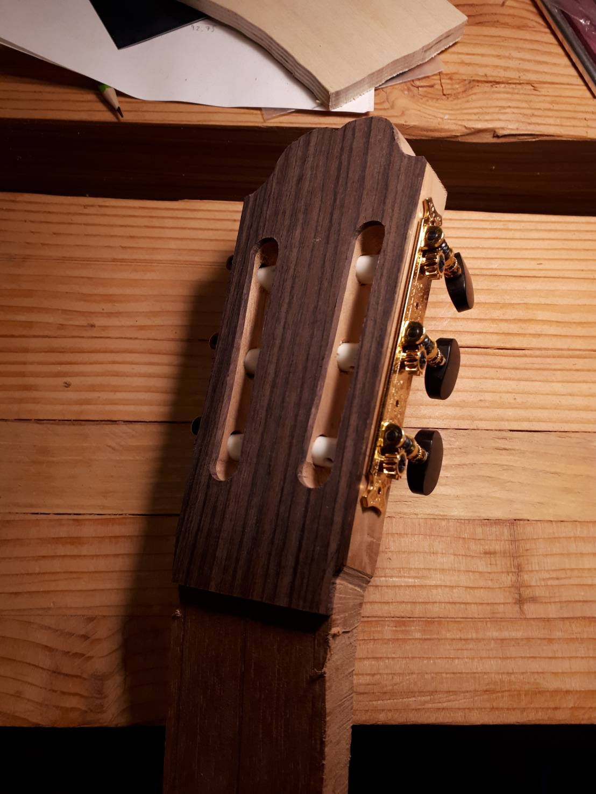
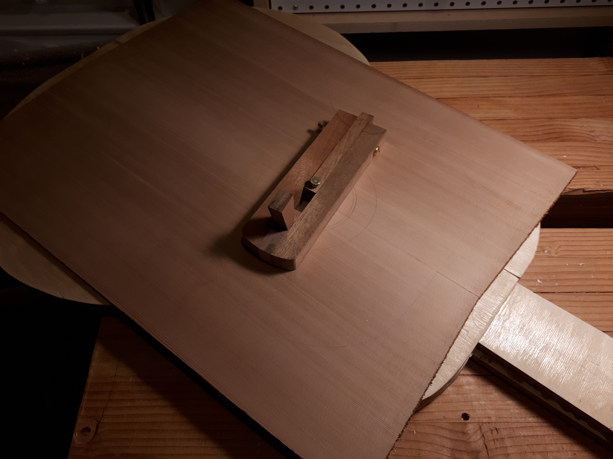
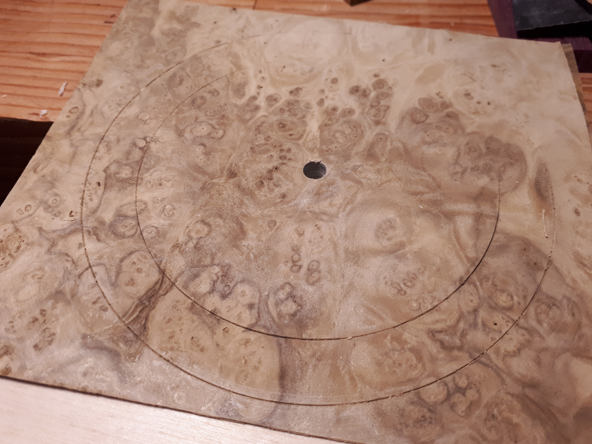
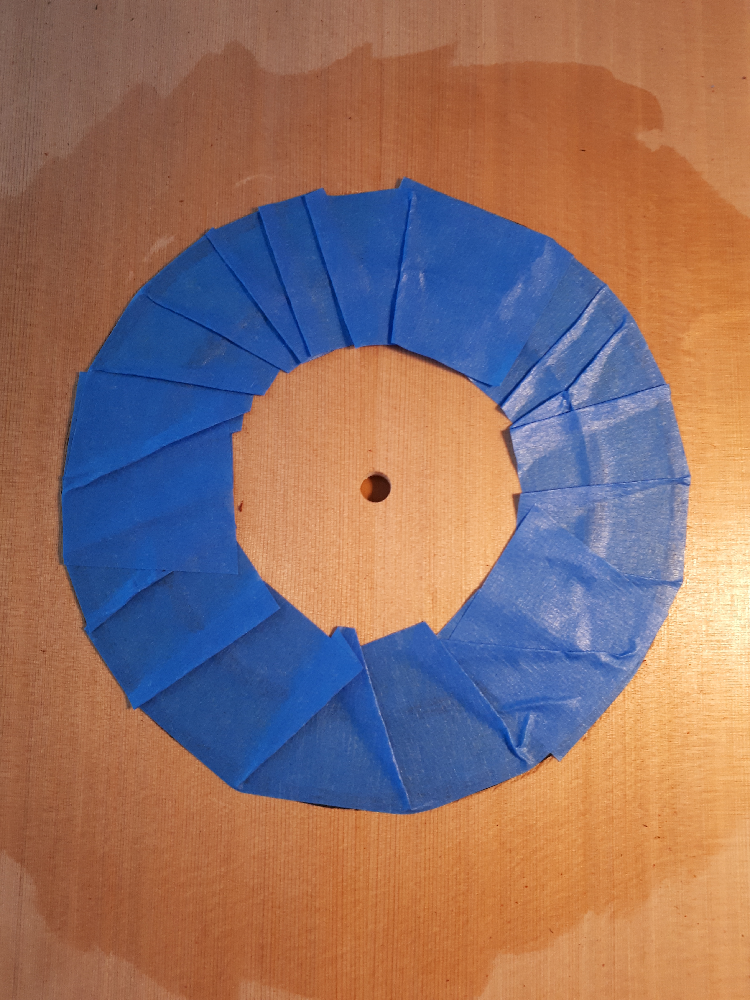
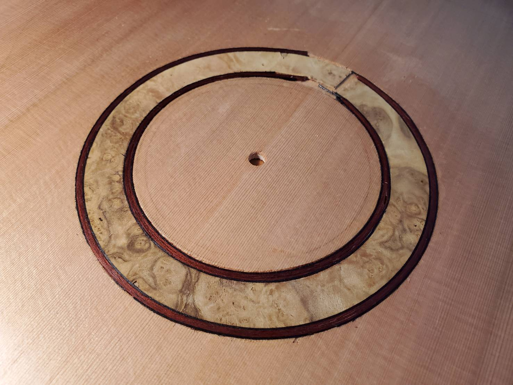
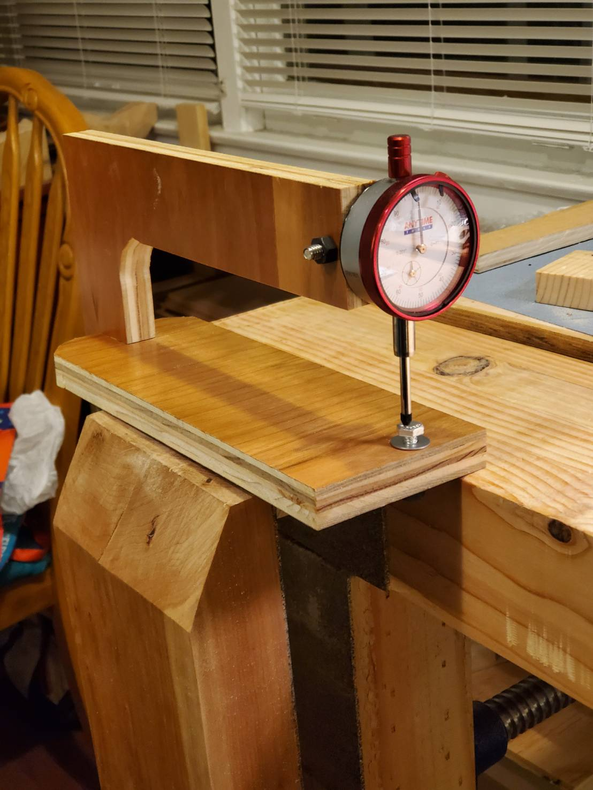

*This post is being updated over time as the build progresses. Stay tuned!*

As I often do, I *may* have underestimated how long it would take to see the end of my first guitar build. This is my travel journal to remember the long journey that started in December 2020. I made my own plans for a 7/8 classical guitar with a scale length of 630mm, inspired by the Cordoba Dolce 7/8 whose size I really liked when I had a chance to try it out in person some time ago. Since it is my first build, the wood choices are conservative: the top is cedar and back/sides are maple.

### Headstock
Started with making the neck/headstock scarf joint, then gluing the head veneer and shaping the head. I forgot to take pictures before the end of this first step, I think. I borrowed the crest shape from Robert Bouchet, I liked its simplicity.

*This is the first time that I thought "maybe this is going to turn out to be a guitar, after all" !*

### Carving the heel
One luthier whom I was watching on Youtube commented that when he was just starting, carving the heel used to take him days on end, but that he now has gotten down to an hour of work for this step. Well, I am still at the other end of the spectrum and maybe even beyond that...

### Joining the soundboard
Tonewood usually comes in two bookmatched halves. The first step is to joint (= make sure the edge is straight) and join them (= glue them together along the edge).

*(Left) Joining the soundboard, using the advice of Pablo Requeña: instead of building a contraption with wedges, the wood is light enough that solid tape can keep the central joint that is being glued under sufficient pressure. (Right) After flattening and cleaning the external side of the soundboard, the outline is drawn using a template and it is time to inlay a rosette.*

### Rosette cutter
One of the tools needed to inlay a rosette and cut the soundhole is a circle cutter. The idea is very simple: a pin slips into a hole at the center of the circle, a blade is at the other end of the tool and it scribes a thin circular cut as the tool rotates around the pin. Commercially available rosette cutters being out of budget, I took the time to build my own out of some mahogany wood that I had lying around. The design is inspired by the circle cutter of Joe Ulman pictured in the February 2012 Hock tools newsletter. The central pin is just a brass door hinge pin and the blade comes from LMI.

*Making my own rosette or circle cutter. The blade is a bit short, but will do for now.*

*Getting a feel on a piece of scrap first... before the real thing!*

### Making and inlaying the rosette
The plan was to make a simple rosette from a commercial wood veneer. The veneer is laurel burl which is a little bit bumpy out of the box. I used veneer softener to first flatten it. Then I followed the wise advice of [Joe Lenzi](http://www.woodystrings.com/home.html) to make the rosette from that pretty thin (1/42", or 0.6mm) veneer: I glued two sheets of veneer together, which yields a 1.2mm thick material ready for the circle cutter.

I decided to inlay the veneer and purfling strips all at once, so I would only have to dig one channel. I cut several concentric rings with the circle cutter, targeting a depth of ~1mm. With chisels I removed the material in the rosette channel.

*Cutting the groove for the rosette (left, flattening in progress), cutting the veneer disc by carefully increasing the depth of the cut (middle), and the veneer rosette ready to inlay! (right)*

*(Left) I broke several purfling strips before deciding to soak them in hot water, bend them around a can of shellac and let them dry overnight. It worked a lot better the next day and I was able to dry-assemble the full rosette against all expectations! (right)*

*Tiny finger plane came in handy to plane down the purfling strips which were sticking out compared to the veneer disc (preparing for the glue step). You can see that I was struggling to keep the strips from jumping out, hence the tape everywhere...*

I adopted the gluing process demonstrated by Pablo Requeña in one of his Youtube videos: taping carefully the full rosette together, popping it out of the channel with a knife, quickly pouring yellow glue and inserting it back. Left is after taping the rosette, middle is what it looked like when taking it out, just before gluing. Right is the messy cleanup after letting the glue dry overnight, using card scrapers. In the middle of this mess, this is when I was the most worried about discovering purfling strips that actually jumped out of the channel and were doomed to disappear after flattening (that partially happened to one of them, sigh) or scraping through the first layer of veneer and exposing the veneer glue (ugh, thankfully that did not happen in the visible portion of the rosette).

It has many mistakes, gaps, the channel edges could be cleaner... but it is my first rosette, and I was expecting much worse! I am afraid attempting to fix the mistakes with epoxy filling would make things worse, so I shall be content with this first attempt.

### Thicknessing the soundboard
After inlaying the rosette, the next step is to turn over the soundboard and remove material on the inside to reach a desired thickness.

*Thicknessing caliper built in-house. The screw allows me to zero the dial if needed. There is a batten underneath that keeps it snug in the vise.*

### Strutting the soundboard

### Joining and strutting the back

### Bending the ribs

### Assembly on a solera

### Purfling and binding

### Fingerboard

### Bridge

### Neck

### Varnish and polish
