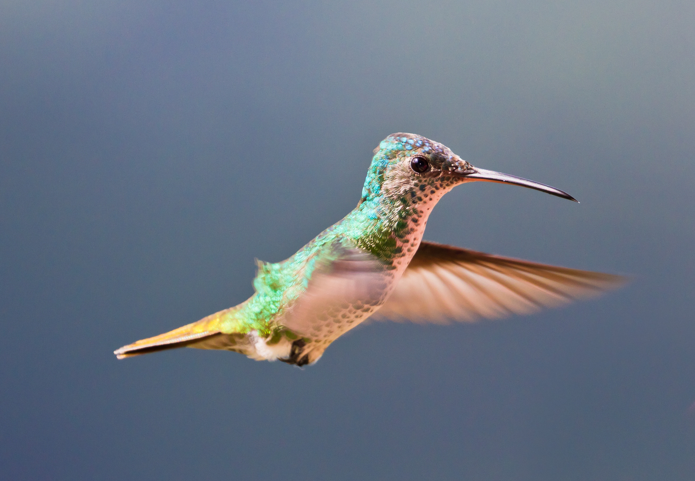

Currently a first-year physics PhD student at Stanford University, working in the Neutrinos group at SLAC National Accelerator Laboratory under the supervision of [Kazuhiro Terao](http://www.codingkazu.com) on deep learning applications to data reconstruction and analysis of liquid argon time projection chambers (LArTPC) such as MicroBooNE.

Formerly graduated from [Ecole polytechnique](https://www.polytechnique.edu/en) (France) where I studied mathematics, physics and computer science.

