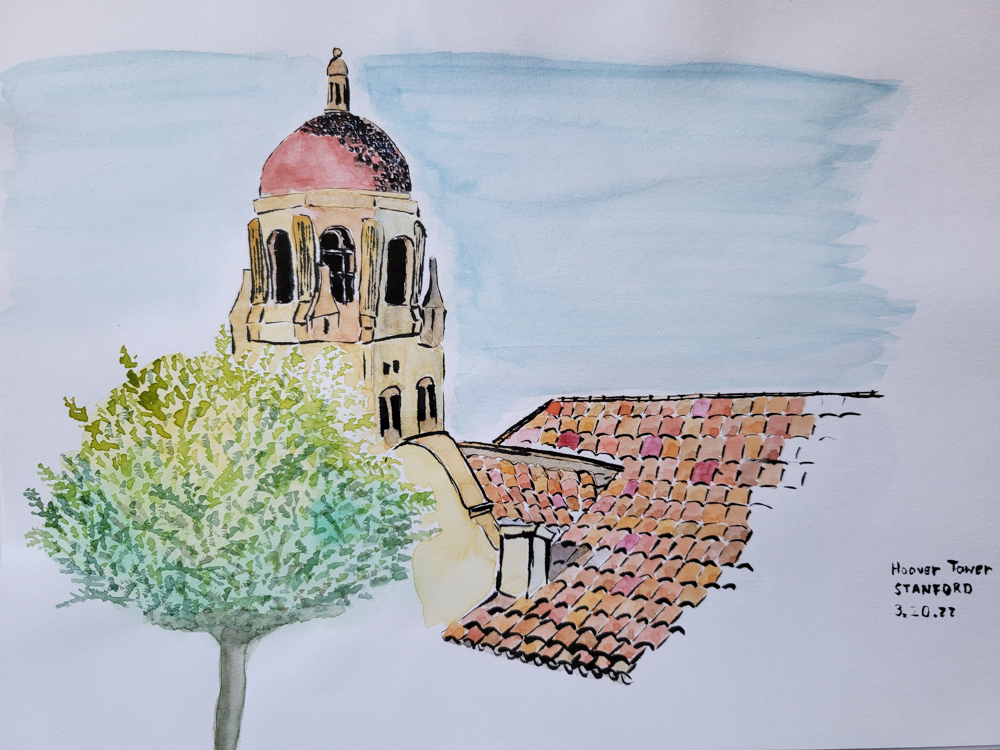

I am a postdoctoral research fellow at the [Center for Astrophysics, Harvard-Smithsonian](https://www.cfa.harvard.edu/).

My field of interest is at the intersection of SETI and machine learning: I am interested in the scientific investigation of Unidentified Aerial Phenomena (UAP) using multi-sensor aerial observation platforms to gather data.

I received my PhD from Stanford in Physics (minor in Linguistics) in June 2023.
