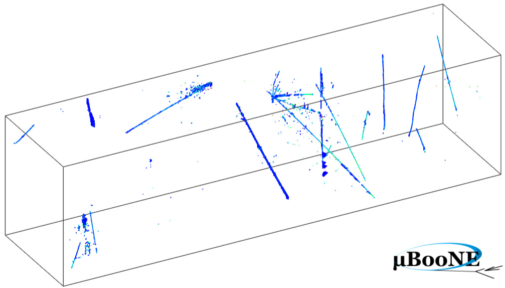
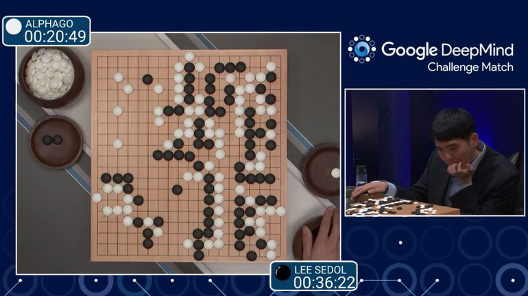
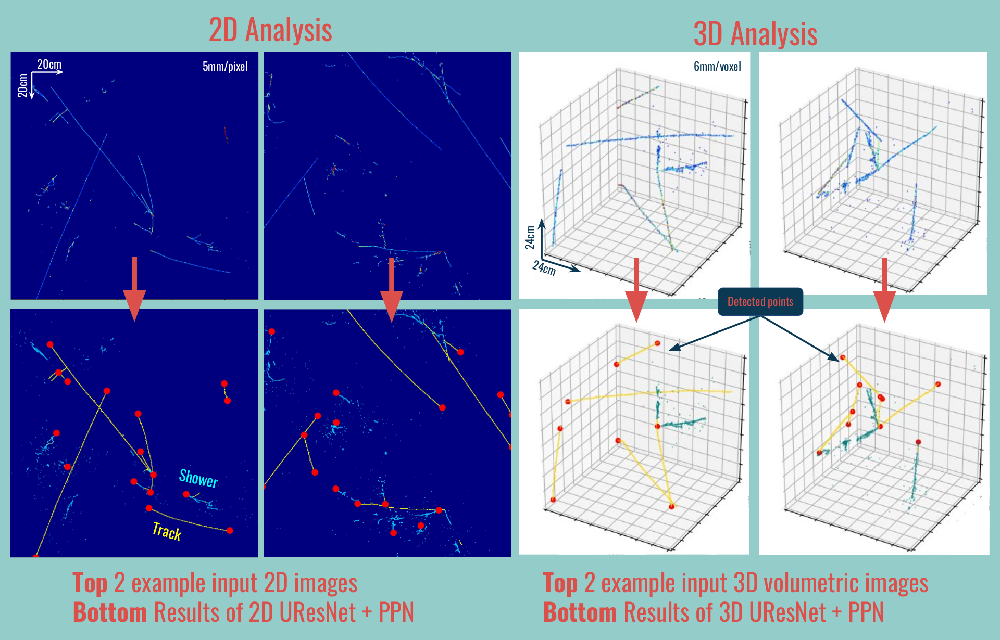

This is where you can learn more about my PhD research. You can also read about my other projects [here](/projects).

## Some context: LArTPC and Deep learning

**Liquid Argon Time Projecting Chambers** (LArTPC) are a type of neutrino detectors, a modern bubble chamber aiming at improving the range and precision of low-energy neutrino scattering measurements. They can help address questions beyond the Standard Model of particle physics such as: what are the neutrinos masses and why are they so much smaller than the masses of all other particles? Are there sterile neutrinos?  

*3D imaging of neutrino interaction event in MicroBooNE LArTPC experiment*

A LArTPC is made of a huge cuve filled with liquid argon and equipped with an electric field. Neutrinos entering the detector collide with argon atoms and knock out a proton or a neutron. Scintillation light is detected with photomultiplier tubes (PMT) and ionization electrons drift through the electric field towards detectors (e.g. wire planes in [MicroBooNE](http://microboone.fnal.gov/) experiment).

*AlphaGo developed by Google DeepMind won against world-class Go player Lee Sedol.*

**Deep neural networks** have had mind-blowing success within the past few years. They beat human-level performance in computer vision and natural language processing tasks. We are developing a full 2D & 3D reconstruction chain for LArTPC detectors using deep learning.

## Pixel Proposal Network

LArTPCs provide fine-grained 2D or 3D images of energy depositions. They are made mainly of particle tracks and electromagnetic showers. Identifying their start and end points at a pixel-level both in 2D and 3D is a critical step to be able to further reconstruct the event (clustering, etc).
To this end we designed and trained a deep neural network architecture, Pixel Proposal Network (PPN), inspired by [Faster R-CNN](https://arxiv.org/abs/1506.01497). It can be trained together with UResNet, another deep neural network based on [U-Net](https://arxiv.org/abs/1505.04597) architecture that can perform pixel-level semantic segmentation on our LArTPC images.

*2D and 3D examples using a simulation sample. The first row is the input images from the LArTPC. The second row is the output of our network. Yellow pixels were labeled by UResNet network as particle tracks, cyan pixels as electromagnetic showers. The red dots are the start/end points predicted by our network PPN.*

[Github repository for PPN](https://github.com/Temigo/faster-particles)

[Applying Deep Neural Network Techniques for LArTPC Data Reconstruction (poster at Neutrino 2018)](https://zenodo.org/record/1300713)

## Submanifold Sparse Convolutional Networks for LArTPC data

Convolutional Neural Networks (CNNs) apply a chain of matrix multiplications and additions, and can be massively parallelized on many-core systems such as GPUs when applied on image data analysis. Yet a unique feature of LArTPC data challenges traditional CNN algorithms: it is locally dense (no gap in a particle trajectory) but generally sparse. A typical 2D LArTPC image has less than 1% of pixels occupied with non-zero value. This makes standard CNNs with dense matrix operations very inefficient. [Submanifold sparse convolutional networks (SSCN)](https://github.com/facebookresearch/SparseConvNet) have been proposed to address exactly this class of sparsity challenges by keeping the same level of sparsity throughout the network. We demonstrated their strong performance on some of our data reconstruction tasks which include 3D semantic segmentation for particle identification at the pixel-level. They outperformed a standard, dense CNN in an accuracy metric with substantially less computations. SSCN can address the problem of computing resource scalability for 3D DL-based data reconstruction chain R&D for LArTPC detectors.

[Slides from talk @ 2018 CPAD Instrumentation Frontier Workshop](https://indico.fnal.gov/event/18104/session/23/contribution/78/material/slides/0.pdf)

[Scalable Deep Convolutional Neural Networks for Sparse, Locally Dense Liquid Argon Time Projection Chamber Data](https://arxiv.org/abs/1903.05663)

## Learn more about...
[Neural networks for neutrinos (Symmetry Magazine)](https://www.symmetrymagazine.org/article/neural-networks-for-neutrinos)

[Game-changing neutrino experiments (Symmetry Magazine)](https://www.symmetrymagazine.org/article/game-changing-neutrino-experiments)

[DeepLearnPhysics](http://deeplearnphysics.org/), a group of experimental particle physicists interested in the application of modern machine learning techniques to analyze experimental physics data.
