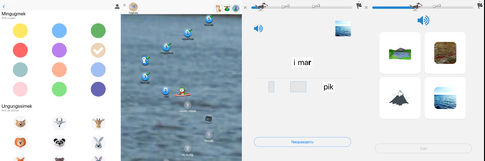
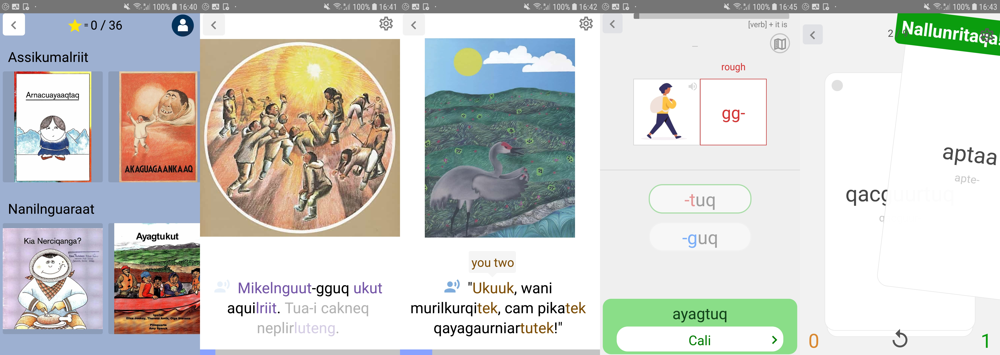

*Jun. 2019 - ongoing*

Various projects related to endangered languages revitalization, to be updated. I am passionate about languages in general, and endangered languages strike a chord with me.

#### Walela Project

I am interested in finding ways to harness artificial intelligence (AI) to help document and revitalize endangered languages. I am currently thinking of pursuing this idea by starting a tech nonprofit. If you have ideas, want to help or are just curious to chat, get in touch with me! I would love to hear your thoughts.

*Glacier Davidson, Haines, Alaska. Image Credit: Diego Delso, http://delso.photo/, License CC-BY-SA*

#### __Yugtun LKSD__ app

With Christopher W. Liu, developed an educational app to facilitate Yup'ik language learning in 18 Yup'ik/English immersion schools of the Lower Kuskokwim School District (LKSD) in Southwest Alaska. The app is available for free on [Google Play Store](https://play.google.com/store/apps/details?id=com.yugtungrammar&hl=en_US) and [Apple Store](https://apps.apple.com/gy/app/yugtun-lksd/id1495576658).

*Built with :blue_heart: using [React Native](https://reactnative.dev/), [PouchDB](https://pouchdb.com/) and [CouchDB](https://couchdb.apache.org/).*

#### __Naaqerkat__ app
Developed with Christopher W. Liu, this is a children's ebooks app in Yup'ik, with audio and word-by-word explanations. Also includes flash cards and language exercises. Available for free on [Google Play Store](https://play.google.com/store/apps/details?id=com.yugtunbooks&hl=en&gl=US) and [Apple Store](https://apps.apple.com/us/app/naaqerkat/id1522318403).

*Built with :blue_heart: using [React Native](https://reactnative.dev/)*

Also see my previous [project on machine translation](/projects/yupik) between Yup'ik Eskimo and English.
