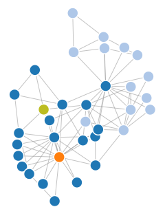

## Whisper App: Rumour source detection
*Sep. 2015 - June 2016. Under the supervision of [Laurent Massoulié](http://pages.saclay.inria.fr/laurent.massoulie/index.htm). With Mickaël Latocca, Rémi Said, Louis Lallemand, Quentin Bertrand, Henri Bourdeau, Carolina Garcia.*

Finding the source of an epidemics can be crucial in many ways: cascading failures and the resulting black-outs are critical for energy distribution networks, virus epidemics that wreak havoc but could be neutralized faster if only we understood where it came from, fake informations spreading on social networks that can have serious consequences for financial markets... Around 2010 some researchers started looking into algorithms to automatically detect the origin of an epidemics given the contaminated graph (or part of it).

I led a team of 6 students at Ecole polytechnique to investigate these rumour source detection algorithms. We designed several algorithms of our own and built a web interface (Whisper App) to allow the interactive execution of algorithms from the literature in addition to ours.

[Try Whisper App online!](http://temigo.pythonanywhere.com/#/) /
[Back-end code](https://github.com/Temigo/whisper-app) /
[Front-end code](https://github.com/Temigo/whisper-app-client) /
[Algorithms implementations](https://github.com/Temigo/whisper)
