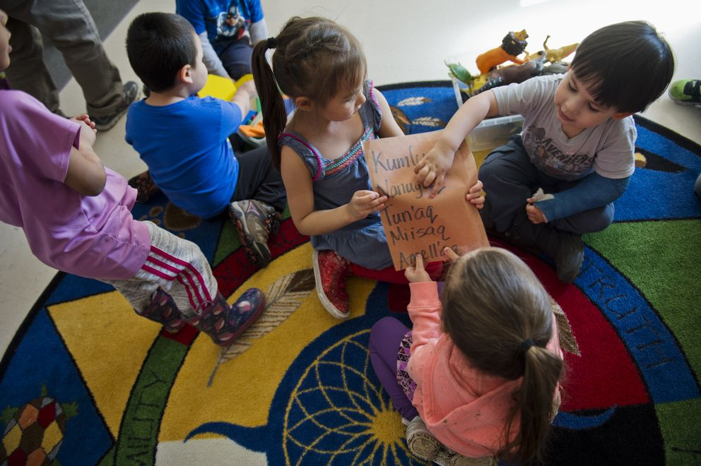
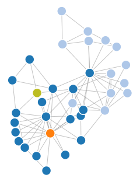

I enjoy(ed) working on these besides my research (in bold projects still ongoing):
* __[Cloud Removal in Hyperspectral Satellite Images using Generative Adversarial Networks](#cloud-removal-in-hyperspectral-satellite-images-using-generative-adversarial-networks)__
* __[Yup'ik Eskimo and Machine Translation for Low-Resource Polysynthetic Languages](#yup'ik-eskimo-and-machine-translation-for-low-resource-polysynthetic-languages)__
* [Whisper App: Rumour source detection](#whisper-app-rumour-source-detection)

## Cloud Removal in Hyperspectral Satellite Images using Generative Adversarial Networks
*Apr. 2018 - ongoing*

Won Best Solo prize and Best Satellogic data use at [Stanford Big Earth Hackathon](https://bigearthhacks.stanford.edu/).

Satellite imagery can be used to monitor the environment or predict disasters and enable quick responses. Clouds bring uneven illumination, blurring and occlusion of the target. Satellite images are traditionally multispectral, i.e. include only a few wavelengths. Hyperspectral images include numerous wavelengths, including near-infrared, and are becoming more widely available. Finally, Generative Adversarial Networks (GANs) are among the most successful unsupervised techniques for generating realistic images by training 2 networks in competition (generator vs discriminator).

*Image Credit:
NASA Goddard Space Flight Center*

I proposed to apply GANs to hyperspectral satellite images in order to generate the missing patches from below the clouds. I devised and implemented the whole data pre-processing pipeline which includes classifying satellite images patches as cloudy/clear and synthesizing cloud masks.

[DevPost](https://devpost.com/software/kumo-san) -
[Invited poster at ICME Xpo 2018](http://stanford.edu/~ldomine/ICME_LDomine.pdf)

<blockquote class="twitter-tweet" data-lang="en-gb">
Congratulations to Laura, who won 2! awards at <a href="https://twitter.com/Stanford?ref_src=twsrc%5Etfw">@Stanford</a> <a href="https://twitter.com/hashtag/BigEarthHacks?src=hash&amp;ref_src=twsrc%5Etfw">#BigEarthHacks</a>: best solo team &amp; best <a href="https://twitter.com/Satellogic?ref_src=twsrc%5Etfw">@Satellogic</a> use 👏♥️👩‍💻. Prize includes tasking our satellites to her favorite spot. Her work:  <a href="https://t.co/nJ9CYceZBW">https://t.co/nJ9CYceZBW</a> <a href="https://t.co/sgDdnqME2x">pic.twitter.com/sgDdnqME2x</a>
&mdash; Bruno Sánchez-Andrade Nuño (@brunosan) <a href="https://twitter.com/brunosan/status/985694650231996416?ref_src=twsrc%5Etfw">16 April 2018</a></blockquote>

## Yup'ik Eskimo and Machine Translation for Low-Resource Polysynthetic Languages
*Jan. 2018 - ongoing, with Christopher W. Liu*

Won 1st prize (based on the reports) for the course project of [CS224n - Natural Language Processing with Deep Learning](http://cs224n.stanford.edu).

Machine translation tools do not yet exist for the Yup'ik Eskimo language. It is an endangered language spoken by around 8,000 people who primarily live in Southwest Alaska. We created a dataset of Yup'ik Eskimo / English parallel text (~100k sentences) and developed a pipeline for reliable translation of this language pair.

We wrote a morphological rule-based parser for the Yup'ik Eskimo language and compared it with other unsupervised tokenization methods. We trained a bidirectional LSTM model with attention and reached a BLEU score of 13 using Byte-Pair Encoding, an unsupervised tokenization method.

*Yup'ik names of children  (Marc Lester / ADN)*

We are now working on the development of **Yuarcuun**, a translation and dictionary tool for Yup'ik Eskimo which will be available online to help revitalize the language.

[Final Report](http://web.stanford.edu/class/cs224n/reports/6907893.pdf) -
[Machine Translation Code](https://github.com/cwtliu/yupik-mt) -
[Yuarcuun API Code](https://github.com/Temigo/yuarcuun-api) -
[Yuarcuun Web interface](https://github.com/Temigo/yuarcuun-web)

<blockquote class="twitter-tweet" data-lang="en-gb">
Byte pair encodings as good as morphological analysis based on Morfessor for low resource machine translation on Yup&#39;ik Eskimo to English. <a href="https://t.co/hdauwgEQUG">pic.twitter.com/hdauwgEQUG</a>
&mdash; Richard (@RichardSocher) <a href="https://twitter.com/RichardSocher/status/976647886099263488?ref_src=twsrc%5Etfw">22 March 2018</a></blockquote>

## Whisper App: Rumour source detection
*Sep. 2015 - June 2016. Under the supervision of [Laurent Massoulié](http://pages.saclay.inria.fr/laurent.massoulie/index.htm). With Mickaël Latocca, Rémi Said, Louis Lallemand, Quentin Bertrand, Henri Bourdeau, Carolina Garcia.*

Finding the source of an epidemics can be crucial in many ways: cascading failures and the resulting black-outs are critical for energy distribution networks, virus epidemics that wreak havoc but could be neutralized faster if only we understood where it came from, fake informations spreading on social networks that can have serious consequences for financial markets... Around 2010 some researchers started looking into algorithms to automatically detect the origin of an epidemics given the contaminated graph (or part of it).

I led a team of 6 students at Ecole polytechnique to investigate these rumour source detection algorithms. We designed several algorithms of our own and built a web interface (Whisper App) to allow the interactive execution of algorithms from the literature in addition to ours.

[Try Whisper App online!](http://temigo.pythonanywhere.com/#/) -
[Back-end code](https://github.com/Temigo/whisper-app) -
[Front-end code](https://github.com/Temigo/whisper-app-client) -
[Algorithms implementations](https://github.com/Temigo/whisper)
